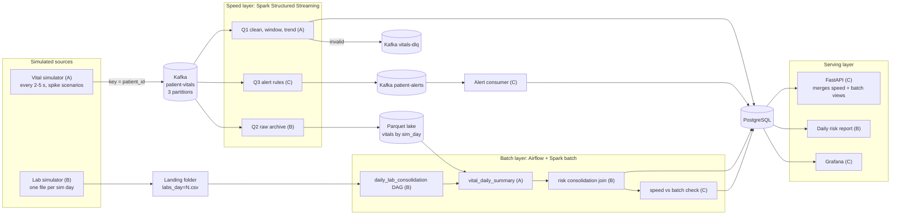

# Ward Vitals Pipeline Plan

**EC8203 Applied Big Data Engineering · Mini-project · Use case 2: Hospital Patient Vital Signs Monitoring**

A 14-day plan for a three-person team building a Lambda-architecture pipeline for bedside vital signs and daily lab results. Each member owns a vertical slice that crosses Kafka, Spark Structured Streaming, Spark batch, Airflow and PostgreSQL, so everyone learns the whole stack and can defend it in the viva.

> **Business question:** Which patients show concerning vital-sign trends right now, and how do yesterday's lab results change the risk picture for those patients going forward?

| Weight | Duration | Team | Architecture | Simulated clock |
|---|---|---|---|---|
| 25% of module | 2 weeks | 3 (A, B, C) | Lambda | 1 sim day = 5 real minutes |

## Contents

1. [Decisions to freeze on Day 1](#1-decisions-to-freeze-on-day-1)
2. [Target architecture](#2-target-architecture)
3. [How the work is split](#3-how-the-work-is-split)
4. [Member slices in detail](#4-member-slices-in-detail)
5. [Learning labs](#5-learning-labs-days-13-everyone-does-all-five)
6. [14-day schedule](#6-14-day-schedule)
7. [Project-defined risk rules](#7-project-defined-risk-rules-starting-point)
8. [Team rules](#8-team-rules)
9. [Report and demo ownership](#9-report-and-demo-ownership)
10. [Where the marks come from](#10-where-the-marks-come-from)
11. [Risks and mitigations](#11-risks-and-mitigations)
12. [Repository layout](#12-repository-layout)
13. [Day 1 checklist](#13-day-1-checklist)

---

## 1. Decisions to freeze on Day 1

Agree on these together in the kickoff and record each one as a short entry in `docs/decisions/`. They are the contracts that let three people work in parallel without blocking each other.

| Decision | Proposal | Why |
|---|---|---|
| **Architecture** | Lambda: speed layer (Spark Structured Streaming) plus batch layer (Airflow + Spark batch), merged in the serving layer | The lab feed is a daily file by nature, and the brief asks for scheduled historical reporting. Kappa is the documented rejected alternative. |
| **Simulated clock** | `SIM_DAY_SECONDS=300`, fixed `SIM_EPOCH` set at startup. `sim_day = floor((ts − epoch) / 300)` | One shared `common/sim_clock.py` used by both simulators, Spark and Airflow, so the "day" means the same thing everywhere. |
| **Vitals event** | `patient_id, heart_rate, spo2, systolic_bp, diastolic_bp, temperature, timestamp` plus `event_id, bed_id` | `event_id` enables de-duplication. 15 patients, one reading per patient every 2–5 s. |
| **Lab file** | `landing/labs/labs_day=N.csv` with `patient_id, test_type, result_value, unit, reference_low, reference_high, collected_at`, written atomically (tmp file, then rename, then `_SUCCESS`) | Splitting the reference range into low and high columns makes the out-of-range check a simple comparison. The atomic write stops Airflow from reading a half-written file. |
| **Kafka topics** | `patient-vitals` (3 partitions, key `patient_id`), `vitals-dlq` (1), `patient-alerts` (3) | The key keeps each patient's readings in order within one partition. Three partitions are enough to show parallelism without extra overhead. |
| **Windows** | Sliding 2-min window, 30-s slide, 1-min watermark (event time) | Holds about 25–60 readings per patient, enough to compute a trend. Tune on Day 5. |
| **Stores** | Parquet lake (immutable raw vitals, partitioned by `sim_day`) + PostgreSQL (serving tables) | The Parquet lake is Lambda's master dataset, so batch views can be recomputed from it. Postgres serves the API, the report and Grafana. |
| **Shared rules** | `config/thresholds.yaml` + `common/risk_rules.py`, imported by both streaming and batch code | Reduces Lambda's main weakness, duplicated logic that drifts apart. This is a strong point for the report. |
| **Versions** | Pin exact image tags for Kafka (KRaft), Spark 3.5.x, Airflow, Postgres 16, Prometheus, Grafana. Never use `latest` | The `spark-sql-kafka` package and the Airflow image's `pyspark` must match the Spark cluster version. |

---

## 2. Target architecture

Tags in brackets show the owner of each box. Every box emits structured JSON logs and Prometheus metrics.



**Observability across all stages:** JSON logs (shared logger), Prometheus metrics from Python services, Spark `StreamingQueryListener` → Pushgateway, `kafka-exporter` for consumer lag, Prometheus alert rules, plus an Airflow health DAG for the daily feed.

---

## 3. How the work is split

The split is by **vertical slice**, not by layer. Nobody is "the frontend person". Each row is a big-data technology, and each member writes real code in every row.

| Technology | Member A · Real-time vitals | Member B · Labs and history | Member C · Alerts, serving, observability |
|---|---|---|---|
| **Kafka** | Vitals producer: keys, partitions, `acks=all`, retries, delivery callbacks. Topic creation script. DLQ topic | Consumes `patient-vitals` for archival: offsets, `startingOffsets`, checkpoints, file-sink exactly-once | `patient-alerts` topic (Spark Kafka sink) + alert consumer service with consumer group. Lag monitoring via kafka-exporter |
| **Spark Streaming** | Q1: parse, validate, de-duplicate, watermark, sliding windows, trend → `patient_current_status` (foreachBatch upsert) | Q2: raw events → Parquet lake partitioned by `sim_day` | Q3: threshold and sustained-abnormal rules → alerts. `StreamingQueryListener` metrics |
| **Spark Batch** | `vital_daily_summary`: recompute per-patient daily vitals from the lake (batch view) | Risk consolidation: latest labs ⋈ vital summary → `daily_patient_risk` | Speed-vs-batch reconciliation: measure drift between the streaming and batch aggregates |
| **Airflow** | `replay_sim_day` DAG: backfill or recompute any day from the lake (shows replay + idempotency) | `daily_lab_consolidation` DAG: FileSensor, validate, load, spark-submit, report, retries, SLA | `pipeline_health` DAG: data freshness, missing lab file, failure callbacks |
| **PostgreSQL** | Upsert logic for current status | Owns `init.sql` schema; `lab_results`, `daily_patient_risk` | `vital_alerts`, `pipeline_health`; API query layer |
| **Simulators** | Vital simulator with seeded scenarios (`--scenario spike --patient P007`) | Lab simulator with missing and out-of-range cases | Reviews both; failure-injection flags (stop, malformed events) |
| **Observability** | Producer metrics: events sent, send errors, last event time | Lab feed and DAG metrics: rows, schema errors, file arrival time | Shared JSON logger, Prometheus, Grafana, alert rules |
| **Docker Compose** | Kafka, kafka-ui, topic-init service | Postgres, Airflow (custom image with Java + pyspark) | Spark master/worker, Prometheus, Pushgateway, Grafana, API |

> The owner builds the slice. A second member is the **pair** who reviews every PR in it and must be able to run and explain it: **A reviews C, B reviews A, C reviews B.** By Day 12 each member also demos a slice that is not their own.

---

## 4. Member slices in detail

### Member A: Real-time vitals
*Kafka lead · Streaming windows*

- **Builds:** Vital simulator, Kafka producer and topic design, DLQ, Spark Q1 (validation, dedup, watermark, windows, trend, vital risk points), `vital_daily_summary` batch job, `replay_sim_day` DAG, `common/sim_clock.py`.
- **Deep learning:** Partitioning and ordering, delivery guarantees, event time vs processing time, watermarks and late data, output modes, foreachBatch, checkpoints.
- **Tests:** Validation rules, window aggregation on a small DataFrame, simulator output schema.
- **Report:** §2 Business requirements, §3 Lambda vs Kappa (first draft, argued jointly), §6 Data design, §7a Streaming processing.

### Member B: Labs and history
*Airflow lead · Batch layer*

- **Builds:** Lab simulator, Spark Q2 raw archive to Parquet, risk consolidation job (lab ⋈ vitals), `daily_lab_consolidation` DAG, Postgres schema, daily HTML/CSV report, `common/risk_rules.py` + `thresholds.yaml`.
- **Deep learning:** Airflow sensors, retries, params, idempotent reruns. Spark joins, groupBy, partitioned Parquet, JDBC writes. File-sink exactly-once.
- **Tests:** Risk-rule unit tests, lab-file validation, DAG import test (DagBag has no errors), rerunning a day produces no duplicate rows.
- **Report:** §4 Architecture diagrams, §7b Batch processing, §8a Storage schema, §10 Results.

### Member C: Alerts, serving, observability
*Observability lead · Serving layer*

- **Builds:** Spark Q3 alert rules → Kafka + alert consumer, `StreamingQueryListener` metrics, reconciliation job, `pipeline_health` DAG, FastAPI (merges speed + batch views), shared JSON logger, Prometheus, Grafana, alert rules.
- **Deep learning:** Stateful streaming rules, Kafka sink and consumer groups, consumer lag, streaming progress metrics, serving-layer merge in Lambda, SLOs and alerting.
- **Tests:** Alert-rule tests, API tests (TestClient), failure drills: producer stopped, DB down, lab file missing.
- **Report:** §5 Tech-stack justification, §8b Serving/API, §9 Observability, §11 Limitations and production scale.

---

## 5. Learning labs (Days 1–3, everyone does all five)

Each lab takes about 2 hours. The member who leads a lab tries it first, then walks the other two through it. Keep lab code in `labs/<name>/`; it is throwaway but useful for the viva.

| Lab | Leads | What to do |
|---|---|---|
| **K · Kafka** | A | Create a 3-partition topic with the CLI, produce keyed messages from Python, run 2 consumers in one group and watch partition assignment, run `kafka-consumer-groups --describe` to see lag. |
| **S1 · Structured Streaming** | A | Read from Kafka, `from_json`, window with a watermark, send to a console sink. Kill the job and restart it with a checkpoint, then explain what happened in the Spark UI. |
| **S2 · Spark batch** | B | Read CSV and Parquet, join, group by, write partitioned Parquet, write to Postgres over JDBC. Compare `explain()` plans. |
| **AF · Airflow** | B | A DAG with FileSensor → PythonOperator → BashOperator (spark-submit), retries, a param. Trigger it, read the task logs, clear a task and rerun it. |
| **O · Observability** | C | JSON logging, prometheus_client counter, gauge and histogram, a Prometheus scrape target, one Grafana panel, one alert rule that fires. |

---

## 6. 14-day schedule

Build one working slice at a time. A simple pipeline that runs end to end earns more marks than a complex one that is half finished.

### Week 1: Learn, contract, thin slice

| Day | Work |
|---|---|
| **Day 1** | **All:** Kickoff (3 h): read the spec together, freeze the decisions above, sketch the architecture, create the GitHub repo (`.gitattributes` with `eol=lf`), assign slices. Start Lab K. |
| **Day 2** | **All:** Docker Compose skeleton: each member adds their services (see split). Goal: `docker compose up` runs cleanly on **every** laptop. Labs K and S1. |
| **Day 3** | Labs S2, AF, O. Shared code: **A** sim_clock · **B** config loader, risk_rules skeleton, `init.sql` · **C** JSON logger, metrics helper. Event and table schemas signed off. |
| **Day 4** | **A** vital simulator + producer + topics · **B** lab simulator (atomic write) · **C** Q3 alert query skeleton, FastAPI skeleton with `/health`. All three streaming queries print to a console sink. |
| **Day 5** | Streaming queries write to their real sinks: **A** Q1 → Postgres upsert · **B** Q2 → Parquet lake · **C** Q3 → `patient-alerts` + alert consumer → `vital_alerts`. |
| **Day 6** | **A** `vital_daily_summary` batch job · **B** DAG v1: sensor → validate → load labs · **C** API `/api/patients`, `/api/alerts`. |
| **Day 7** ⭐ | **Milestone M1: Thin end-to-end slice.** A vital reaches the API, and a lab file reaches Postgres through Airflow. **All:** Teach-back #1: each member presents their code for 30 minutes and the other two ask viva-style questions. Remaining time is buffer. |

### Week 2: Complete, observe, prove, write

| Day | Work |
|---|---|
| **Day 8** | **B** consolidation join + risk scoring → `daily_patient_risk` · **A** trend detection, DLQ, `replay_sim_day` DAG · **C** reconciliation job, `pipeline_health` DAG. |
| **Day 9** | Observability: each member instruments their own components. **C** Prometheus, Pushgateway, kafka-exporter, Grafana dashboards, alert rules: no vitals for 30 s, lab file late, error rate, consumer lag. |
| **Day 10** ⭐ | **Milestone M2: Feature complete, then freeze.** **B** daily report generator · **C** API merges speed + batch views (`/api/patients/{id}`, `/api/metrics`) · **A** deterministic demo scenarios. |
| **Day 11** | Tests and failure drills from the guide's checklist. Each member writes tests for their own slice plus one for their pair's slice. Clone the repo fresh on a **second laptop** and reproduce the whole run from the README. |
| **Day 12** | Take screenshots (Kafka UI partitions, Spark UI, Airflow graph and logs, API output, Grafana, report, alert firing). Draft report sections. **All:** Teach-back #2 with rotation: each member demos a slice that is not their own. |
| **Day 13** | Finish the report (8–15 pages, PDF), README and contributions statement. Record the demo video, with each member presenting their own slice. |
| **Day 14** ⭐ | **Submit.** Buffer, final cross-review of the report, tag release `v1.0`, submit the repo link, PDF and video. |

---

## 7. Project-defined risk rules (starting point)

> These are simulated academic rules for a data-engineering exercise, **not clinical guidance**. Say this in the README and the report. Keep them in `config/thresholds.yaml` and tune them as a team.

| Indicator | Rule (per 2-min window) | Points | Layer |
|---|---|---|---|
| SpO₂ | min < 92 % | +2 | speed |
| Heart rate | avg < 50 or > 120 bpm | +1 | speed |
| Temperature | max > 38.0 °C | +1 | speed |
| Blood pressure | systolic > 160 or < 90 mmHg | +1 | speed |
| Trend | HR rising or SpO₂ falling across 3 consecutive windows | +1 | speed |
| Lab result | outside the reference range (+2 if beyond 1.5× the range) | +1 / +2 | batch |

**Categories:** 0–1 **NORMAL** · 2–3 **WATCH** · ≥ 4 **CONCERNING**. A missing lab result is reported as `LAB_UNAVAILABLE`, never as 0.

Suggested lab tests: potassium, creatinine, haemoglobin, WBC, CRP, lactate. The API returns vital risk (speed view), lab risk (latest batch view) and the combined category. That combination is the Lambda serving-layer merge, and it answers the second half of the business question.

---

## 8. Team rules

### Git workflow
- Protect `main`; each feature gets its own branch and PR.
- Every PR is reviewed by the slice's pair. A reviewer who cannot explain the code does not approve it.
- Conventional commit messages, so the contributions statement can be written from `git log`.

### Rhythm
- 15-minute stand-up daily: what I finished, what I'm doing next, what's blocking me.
- Teach-backs on Day 7 and Day 12 are compulsory. They are the viva rehearsal.
- Commit screenshots to `docs/screenshots/` as soon as each feature works.

### Definition of done
- Runs in Docker Compose from a clean clone.
- Emits JSON logs with `component, event, severity, patient_id / sim_day`.
- Exposes at least one metric and has at least one test.
- Documented in the README.

### Viva questions everyone must answer
- Why `patient_id` as the key? What happens to ordering if partitions change?
- What does the watermark do? What happens to a reading that is 3 minutes late?
- What happens after a restart? Which sinks are exactly-once, and how is the JDBC sink made idempotent?
- What would Kappa look like here, and why did you reject it?
- How do you detect that the producer has stopped? How would you know the speed and batch layers disagree?

---

## 9. Report and demo ownership

### Report

| Report section | Drafts | Reviews |
|---|---|---|
| 1 Introduction · 12 Conclusion · Contributions statement | All | — |
| 2 Business requirements · 3 Lambda vs Kappa (latency, replay, cost, consistency, rejected alternative) | A | B, C |
| 6 Data design (schemas, topic, partitions, clock) · 7a Streaming processing | A | B |
| 4 Architecture diagrams · 7b Batch processing · 8a Storage · 10 Results | B | C |
| 5 Tech stack justification · 8b Serving/API · 9 Observability · 11 Limitations and production scale | C | A |

> Section 3 is worth **20 marks**, the largest single criterion. Argue it as a team on Day 1, write it up on Day 12, and have all three members review it.

### Demo (5–10 minutes)

| Time | Content | Presenter |
|---|---|---|
| 0:00–1:00 | Use case, business question, architecture diagram | A |
| 1:00–3:30 | Compose services, Kafka partitions, simulator running, Spark streaming progress | A |
| 3:30–5:30 | API and Grafana; trigger a spike for P007 → alert; stop the producer → no-data alert fires | C |
| 5:30–8:30 | Advance a sim day → lab file → Airflow DAG run → consolidated risk report | B |
| 8:30–10:00 | Trade-offs, reconciliation result, limitations, production improvements | C |

---

## 10. Where the marks come from

| Criterion | Marks | Covered by |
|---|---|---|
| Architecture decision (Lambda vs Kappa) | 20 | Day 1 decisions, §3, reconciliation job as evidence of the consistency trade-off, replay DAG as evidence of replay |
| Tech stack justification | 10 | §5, with each tool tied to a use-case constraint |
| Data ingestion | 15 | Keyed producer, retries, DLQ, atomic lab drop, seeded scenarios |
| Processing | 15 | Q1–Q3, windows and watermark, trend, lab join, risk scoring |
| Storage and serving | 10 | Postgres serving tables, Parquet lake, API merging speed and batch views, daily report |
| Observability | 10 | JSON logs, Prometheus, lag, streaming metrics, alert rules, health DAG, failure drills |
| Report | 15 | Split drafting, cross-review, screenshots from Day 12 |
| Code quality | 5 | Modular slices, config outside code, tests, README, clean-clone test on Day 11 |
| **Total** | **100** | |

---

## 11. Risks and mitigations

| Risk | Mitigation |
|---|---|
| The whole stack (Kafka, Spark, Airflow, Postgres, Grafana) is too heavy for a Windows laptop | Give WSL2 at least 8–10 GB in `.wslconfig`. Run Airflow with LocalExecutor and its metadata DB in the same Postgres. Use one Spark worker. Use a compose profile to leave Grafana out when it isn't needed. |
| Spark, Kafka connector and pyspark versions don't match | Pin one Spark 3.5.x version everywhere. Check on Day 2 that Airflow can `spark-submit` a hello-world job. |
| Windows line endings break shell scripts in containers | Add `.gitattributes` with `* text=auto eol=lf` on Day 1. |
| One slice blocks the others | Freeze contracts (event schema, topic, tables) on Day 3. Each slice can be tested with fake input. |
| Random data makes the demo fail | Seeded RNG and scenario flags. Rehearse from a clean `docker compose down -v`. |
| A member can't explain someone else's code in the viva | Pair reviews, two teach-backs, and the Day 12 rotation demo. |

---

## 12. Repository layout

Owner of each part in brackets.

```text
hospital-big-data-pipeline/
├── README.md  docker-compose.yml  .env.example  .gitattributes
├── config/            app.yaml  thresholds.yaml                          [B]
├── common/            sim_clock.py [A]  logger.py metrics.py [C]  risk_rules.py config.py [B]
├── simulators/        vital_producer/ [A]   lab_batch/ [B]
├── kafka/             init/create_topics.sh                              [A]
├── spark/
│   ├── streaming/     app.py  q1_windows.py [A]  q2_archive.py [B]  q3_alerts.py listener.py [C]
│   └── batch/         vital_daily_summary.py [A]  risk_consolidation.py [B]  reconcile.py [C]
├── airflow/           Dockerfile  dags/ daily_lab_consolidation.py [B]  replay_sim_day.py [A]  pipeline_health.py [C]
├── database/          init/init.sql                                      [B]
├── api/               main.py  routers/  alert_consumer.py                [C]
├── observability/     prometheus/ (scrape + alert rules)  grafana/ (provisioned dashboards)  [C]
├── reports/           generate_report.py [B]   sample/
├── tests/             one folder per slice
├── labs/              throwaway learning-lab code
└── docs/              architecture/  decisions/  screenshots/  report/
```

---

## 13. Day 1 checklist

- [ ] Everyone reads both PDFs before the kickoff.
- [ ] Assign names to A, B and C. Consider each person's interest, but don't hand the slice closest to someone's comfort zone to them by default.
- [ ] Check each laptop's RAM. Choose the demo machine (16 GB or more preferred).
- [ ] Walk through the decisions table and write each one into `docs/decisions/`.
- [ ] Argue Lambda vs Kappa out loud for 30 minutes, with one person defending Kappa. Keep the notes; they become §3.
- [ ] Create the GitHub repo, branch protection, `.gitattributes`, the folder skeleton and an empty README.
- [ ] Confirm the submission deadline and write the real dates next to Day 1–14.
- [ ] A starts preparing Lab K for Day 2.

---

*Based on the EC8203 mini-project brief and the Hospital Patient Vital Signs implementation guide. Thresholds are simulated project rules, not clinical guidance.*
