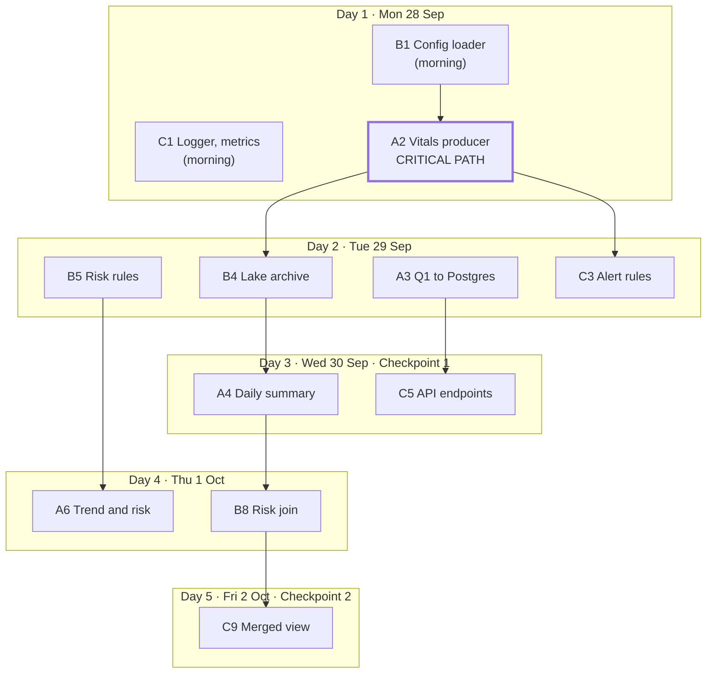

# Member Work Plan (fast track)

**EC8203 Ward Vitals Pipeline · Ninada (A) · Imalsha (B) · Kasun (C)**

Build days start on Mon 28 Sep, and the pipeline should be feature complete by Fri 2 Oct. Everything is submitted by Mon 5 Oct, four days ahead of the Fri 9 Oct deadline. The plan keeps only what the brief and the implementation guide require; everything else is cut (see [§7](#7-what-was-cut-and-why)). Background on the design is in [PROJECT_PLAN.md](PROJECT_PLAN.md).

## Contents

1. [Team and schedule](#1-team-and-schedule)
2. [Everyone, today (Sun 27 Sep)](#2-everyone-today-sun-27-sep)
3. [Ninada (A): Real-time vitals](#3-ninada-a-real-time-vitals)
4. [Imalsha (B): Labs and history](#4-imalsha-b-labs-and-history)
5. [Kasun (C): Alerts, serving, observability](#5-kasun-c-alerts-serving-observability)
6. [Handoffs and checkpoints](#6-handoffs-and-checkpoints)
7. [What was cut, and why](#7-what-was-cut-and-why)
8. [Brief requirements checklist](#8-brief-requirements-checklist)

---

## 1. Team and schedule

| Member | Slice | Reviews the code of |
|---|---|---|
| **Ninada** (A) | Vitals simulator, Kafka producer, Q1 streaming windows → `patient_current_status`, daily vital summary | Kasun |
| **Imalsha** (B) | Config, lab simulator, Q2 raw archive → Parquet lake, risk rules, lab DAG, risk join, daily report | Ninada |
| **Kasun** (C) | Logger and metrics, Q3 alerts → Kafka → `vital_alerts`, FastAPI, Prometheus alert rules, Grafana | Imalsha |

| Day | Date | Goal |
|---|---|---|
| 0 | Sun 27 Sep | Every laptop runs the stack |
| 1 | Mon 28 Sep | Shared code merged; both simulators produce data |
| 2 | Tue 29 Sep | All three streaming queries write to their real outputs |
| 3 | Wed 30 Sep | **Checkpoint 1**: a vital reaches the API; a lab file reaches Postgres through Airflow |
| 4 | Thu 1 Oct | Risk join, daily report, trend, alert rules |
| 5 | Fri 2 Oct | **Checkpoint 2**: feature freeze; merged API view and metrics working |
| 6 | Sat 3 Oct | Tests, failure drills, screenshots, fresh-clone check |
| 7–8 | Sun 4 – Mon 5 Oct | Report, README, demo video, **submit** |

### How to use this plan

- Work through your own section top to bottom. Step numbers (A1, B1, C1…) give the order.
- Tick a step (`[x]`) only when its **Done when** line is true.
- **Waits for** means another member's step must be merged first. If it is late, say so at stand-up the same day.
- One branch per step (`ninada/producer`, `imalsha/lab-dag`, `kasun/api`), a pull request to `main`, and a quick review by your pair. Use `feat:`, `fix:`, `test:` and `docs:` commit messages, because the contributions statement is written from `git log`.
- 10-minute stand-up each day: done, next, blocked.

---

## 2. Everyone, today (Sun 27 Sep)

About 1–2 hours in total.

- [ ] **S1. Confirm the design (30 min, together).** Read [PROJECT_PLAN.md §1](PROJECT_PLAN.md#1-decisions-to-freeze-on-day-1) and [§7](PROJECT_PLAN.md#7-project-defined-risk-rules-starting-point) and agree them as they are. Don't write separate decision files; the report covers the decisions. **Done when:** nobody has an objection.
- [ ] **S2. Laptop setup.** Give WSL2 at least 8–10 GB in `%UserProfile%\.wslconfig`, then run `wsl --shutdown` and restart Docker Desktop. Clone the repo, run `cp .env.example .env`, `docker compose build` and `docker compose up -d`. **Done when:** `docker compose ps -a` shows every service running or healthy.
- [ ] **S3. Environment check.** Run `docker compose exec airflow airflow dags test env_check`. **Done when:** it ends with `state=success` on **all three** laptops.
- [ ] **S4. Pick the demo laptop:** the one with the most RAM.

---

## 3. Ninada (A): Real-time vitals

Ninada's producer is on the critical path: Q1, Q2, Q3 and the API all need vitals in Kafka, so **A2 must be merged by the end of Day 1**.

**Technologies:** Kafka producer (keys, partitions, `acks=all`) · Spark Structured Streaming (watermark, sliding windows, `foreachBatch`) · Spark batch · PostgreSQL upsert.

### Day 1 · Mon 28 Sep: clock and producer

- [x] **A1. Simulated clock** in `common/sim_clock.py`: `sim_day(ts)`, `day_start(n)`, `day_end(n)`, `current_sim_day()`, reading `SIM_EPOCH` and `SIM_DAY_SECONDS` through `common/config.py`. Add a test in `tests/slice_a/test_sim_clock.py`. **Waits for:** B1.
- [x] **A2. Vitals producer** in `simulators/vital_producer/main.py`. It sends 15 patients (P001–P015), one reading per patient every 2–5 s, as JSON with `event_id, patient_id, bed_id, heart_rate, spo2, systolic_bp, diastolic_bp, temperature, timestamp`.
    - Kafka settings: key = `patient_id`, `acks=all`, retries, delivery callback.
    - Seeded random numbers.
    - Flags: `--scenario spike --patient P007` and `--malformed-rate 0.02` (a share of bad events, for testing).
    - Add it as a service in `docker-compose.yml`.

    **Done when:** Kafka UI shows messages on all 3 partitions, and each patient always lands on the same partition. Tell the team in the group chat.

### Day 2 · Tue 29 Sep: Q1 to PostgreSQL

- [x] **A3. Q1** in `spark/streaming/q1_windows.py`, started from `spark/streaming/app.py`:
    1. Parse the JSON and validate it: nulls and out-of-range values are invalid.
    2. Send invalid records to `vitals-dlq` with a `reason` field.
    3. Drop duplicate `event_id`s with a 1-minute watermark.
    4. Compute a 2-minute sliding window with a 30-second slide on event time: average, minimum and maximum of each vital per patient.
    5. Upsert the results with `foreachBatch` into `patient_current_status` (`INSERT … ON CONFLICT`), with a checkpoint in `/data/checkpoints/q1`.

    **Done when:** the table updates every 30 s, restarting Spark creates no duplicates, and malformed events appear in `vitals-dlq`.

### Day 3 · Wed 30 Sep: batch view + Checkpoint 1

- [x] **A4. Daily vital summary** in `spark/batch/vital_daily_summary.py`. It reads one `sim_day` from `/data/lake/vitals` and writes per-patient daily averages, minimums, maximums and counts to `vital_daily_summary`. A rerun replaces that day's rows. **Waits for:** B4. **Done when:** running it twice for one day gives the same rows.
- [x] **A5. Checkpoint 1.** A P007 spike shows in `patient_current_status` and in `/api/patients`.

### Day 4 · Thu 1 Oct: trend and risk

- [x] **A6. Trend and vital risk points** in Q1. Mark heart rate rising or SpO₂ falling across 3 consecutive windows, and score each window with `common/risk_rules.py`. Write `risk_score` and `risk_status` into `patient_current_status`. **Waits for:** B5.

### Day 5 · Fri 2 Oct: metrics, demo scenarios, freeze

- [x] **A7. Producer metrics and logs.** `events_sent_total`, `send_errors_total` and `last_event_timestamp` through `common/metrics.py`; JSON logs through `common/logger.py`. **Waits for:** C1.
- [x] **A8. Demo scenarios.** Seeded and repeatable: SpO₂ drop for P007, heart-rate spike, producer stop. **Done when:** the same seed gives the same alerts twice.

### Day 6 · Sat 3 Oct: prove it

- [x] **A9. Tests** in `tests/slice_a/`: validation rules, window aggregation on a small DataFrame, simulator output fields.
- [ ] **A10. Screenshots** to `docs/screenshots/`: Kafka UI partitions, the Spark streaming UI, `vitals-dlq` messages.

### Day 7–8 · Sun 4 – Mon 5 Oct: write and submit

- [x] **A11. Report:** §2 Business requirements, §3 Lambda vs Kappa (lead writer; B and C review, 20 marks), §6 Data design (schemas, topics, partitions, simulated clock), §7a Streaming processing.
- [ ] **A12. Demo video** 0:00–3:30: use case, architecture, Compose services, Kafka partitions, simulator, Spark streaming progress.

---

## 4. Imalsha (B): Labs and history

Imalsha's `common/config.py` is the first file the team needs, so **B1 goes first on Day 1 morning**. The lab simulator and the lab DAG depend on nobody, so B2 and B6 can run at full speed.

**Technologies:** Spark Structured Streaming (Kafka offsets, file sink) · Parquet lake · Spark batch (join, JDBC) · Airflow (FileSensor, retries, callbacks) · PostgreSQL schema.

### Day 1 · Mon 28 Sep: config, lab files, schema

- [ ] **B1. Config loader** in `common/config.py`. It loads `config/app.yaml`, lets environment variables override values, and exposes `get_settings()`. Extend `tests/test_config.py`. **Done when:** merged before noon; Ninada's clock (A1) builds on it.
- [ ] **B2. Lab simulator** in `simulators/lab_batch/main.py`. It writes one file per simulated day, `data/landing/labs/labs_day=N.csv`, with columns `patient_id, test_type, result_value, unit, reference_low, reference_high, collected_at`.
    - Tests: potassium, creatinine, haemoglobin, WBC, CRP, lactate.
    - Include some missing patients and out-of-range values.
    - Write atomically: temporary file → rename → `_SUCCESS`.

    **Done when:** a new file appears every 5 minutes on the host, and no half-written file is ever visible.
- [ ] **B3. Schema check.** Confirm the 6 tables in `database/init/01_schema.sql` fit what A, B and C write. Change them now, not later.

### Day 2 · Tue 29 Sep: lake archive and risk rules

- [ ] **B4. Q2 raw archive** in `spark/streaming/q2_archive.py`. Write raw vitals to `/data/lake/vitals`, partitioned by `sim_day`, with a checkpoint in `/data/checkpoints/q2`. **Waits for:** A2. **Done when:** `sim_day=N` folders appear and a Spark restart creates no duplicate files.
- [ ] **B5. Risk rules** in `common/risk_rules.py`: `vital_points(...)`, `lab_points(...)`, `category(total)`, reading `config/thresholds.yaml`. Add unit tests for every threshold and category boundary in `tests/slice_b/`. **Done when:** merged, so Ninada (A6) and Kasun (C3) can import it.

### Day 3 · Wed 30 Sep: lab DAG + Checkpoint 1

- [ ] **B6. Lab DAG** in `airflow/dags/daily_lab_consolidation.py`:
    1. A FileSensor waits for `_SUCCESS`.
    2. Validate the CSV: columns, types, ranges.
    3. Load it into `lab_results`, replacing that day's rows.
    4. Add retries, plus a failure callback that writes a row to `pipeline_health`.

    **Done when:** triggering a day twice leaves no duplicates, and a missing file makes the DAG fail clearly.
- [ ] **B7. Checkpoint 1.** A lab file reaches `lab_results` through Airflow.

### Day 4 · Thu 1 Oct: risk join and report

- [ ] **B8. Risk join** in `spark/batch/risk_consolidation.py`. Join the latest labs with `vital_daily_summary`, add lab points and the category, and write to `daily_patient_risk`. A patient with no lab result is `LAB_UNAVAILABLE`, never 0. **Waits for:** A4.
- [ ] **B9. DAG v2 and daily report.** Add DAG tasks that spark-submit `vital_daily_summary` and `risk_consolidation`, then run `reports/generate_report.py`, which writes HTML and CSV to `data/reports/`. Commit one sample to `reports/sample/`. **Done when:** one DAG run goes from lab file to report.

### Day 5 · Fri 2 Oct: metrics, freeze

- [ ] **B10. Lab feed metrics and logs.** Rows loaded, schema errors and last file time, pushed through `common/metrics.py`; JSON logs through `common/logger.py`. **Waits for:** C1.

### Day 6 · Sat 3 Oct: prove it

- [ ] **B11. Tests** in `tests/slice_b/`: lab-file validation, DAG import (no DagBag errors), rerunning a day gives no duplicates.
- [ ] **B12. Screenshots** to `docs/screenshots/`: Airflow graph and task logs, lake folders, the daily report.

### Day 7–8 · Sun 4 – Mon 5 Oct: write and submit

- [ ] **B13. Report:** §4 Architecture diagrams, §7b Batch processing, §8a Storage, §10 Results.
- [ ] **B14. Demo video** 5:30–8:30: advance a simulated day, the lab file lands, the DAG runs, the risk report opens.

---

## 5. Kasun (C): Alerts, serving, observability

Kasun's logger and metrics helpers are imported by every component, so **C1 goes first on Day 1 morning**. Until Ninada's producer lands, Kasun builds the API skeleton.

**Technologies:** Spark Structured Streaming (alert rules, Kafka sink) · Kafka consumer group · FastAPI · PostgreSQL · Prometheus, Pushgateway, kafka-exporter, Grafana.

### Day 1 · Mon 28 Sep: helpers and API skeleton

- [ ] **C1. Logger and metrics.** `common/logger.py`: `get_logger(component)` prints one JSON object per line with `timestamp, component, event, severity` and optional `patient_id`, `sim_day`. `common/metrics.py`: counter, gauge and histogram helpers, a metrics endpoint for long-running services, and a Pushgateway push for batch jobs. **Done when:** merged before noon with a test in `tests/slice_c/`.
- [ ] **C2. FastAPI skeleton** in `api/main.py`: `/health` checks that PostgreSQL answers. **Done when:** http://localhost:8000/health returns OK and `/docs` loads.

### Day 2 · Tue 29 Sep: alerts end to end

- [ ] **C3. Q3 alert rules** in `spark/streaming/q3_alerts.py`: threshold alerts (for example SpO₂ below 92) and sustained-abnormal alerts, from `config/thresholds.yaml`. Write to the `patient-alerts` topic with a checkpoint in `/data/checkpoints/q3`. **Waits for:** A2. **Done when:** P007's spike scenario produces an alert in Kafka UI.
- [ ] **C4. Alert consumer** in `api/alert_consumer.py`: its own consumer group, writing each alert to `vital_alerts`. **Done when:** alerts appear in the table and a restart writes nothing twice.

### Day 3 · Wed 30 Sep: API endpoints + Checkpoint 1

- [ ] **C5. Endpoints** in `api/routers/`: `/api/patients` (from `patient_current_status`) and `/api/alerts` (from `vital_alerts`). **Waits for:** A3.
- [ ] **C6. Checkpoint 1.** A vital reading and its alert are visible through the API.

### Day 4 · Thu 1 Oct: monitoring

- [ ] **C7. Spark streaming metrics** in `spark/streaming/listener.py`: a `StreamingQueryListener` pushes input rate, batch duration and rows processed to Pushgateway.
- [ ] **C8. Alert rules and one dashboard.** Run `docker compose --profile monitoring up -d`. In `observability/`, add Prometheus alert rules for: no vitals for 30 s, lab file late, consumer lag. Build **one** Grafana dashboard covering vitals rate, alerts, consumer lag and Spark batch duration. **Done when:** stopping the producer fires the no-vitals alert.

### Day 5 · Fri 2 Oct: serving-layer merge, freeze

- [ ] **C9. Merged view.** `/api/patients/{id}` returns vital risk (speed layer), lab risk (batch layer) and the combined category. `/api/metrics` exposes API request metrics. **Waits for:** B8.

### Day 6 · Sat 3 Oct: prove it

- [ ] **C10. Tests** in `tests/slice_c/`: alert rules, and API tests with `TestClient`.
- [ ] **C11. Failure drills:** producer stopped, database down, lab file missing, malformed events. Write down what happened and how it was detected (this goes into report §9).
- [ ] **C12. Screenshots** to `docs/screenshots/`: API output, the Grafana dashboard, an alert firing.

### Day 7–8 · Sun 4 – Mon 5 Oct: write and submit

- [ ] **C13. Report:** §5 Tech-stack justification, §8b Serving/API, §9 Observability, §11 Limitations and production scale.
- [ ] **C14. Demo video** 3:30–5:30 (API, Grafana, spike alert, no-data alert) and 8:30–10:00 (trade-offs, limitations).

---

## 6. Handoffs and checkpoints

Two steps unblock the most work: Ninada's producer (**A2**) feeds Q2 and Q3, and Ninada's daily summary (**A4**) feeds the risk join. Each arrow means *finish this first*.

| Checkpoint | Date | Must be true |
|---|---|---|
| **1**: thin slice | Wed 30 Sep | A P007 spike reaches `/api/patients` and raises an alert, and a lab file reaches `lab_results` through Airflow |
| **2**: feature freeze | Fri 2 Oct | Every build step up to A8, B10 and C9 is merged; after this only fixes, tests and writing |
| **Submit** | Mon 5 Oct | Report PDF (8–15 pages), repo tagged `v1.0`, demo video, contributions statement |

### Together at the end (Sat 3 – Mon 5 Oct)

- [ ] **E1. Fresh clone** on a second laptop; run everything from the README only.
- [ ] **E2. One-hour code walkthrough.** Each member explains their slice to the other two. The brief says every member must be able to explain every line of core pipeline logic in a viva.
- [ ] **E3. Report assembly:** §1 Introduction, §12 Conclusion, and the individual contributions statement (required for group submissions). Export the report to PDF.
- [ ] **E4. Submit:** tag `v1.0`, then submit the repo link, the PDF and the video.

### Definition of done for every step

- It runs in Docker Compose from a clean clone.
- It writes JSON logs through `common/logger.py`.
- The reviewing pair has read it and can explain it.

---

## 7. What was cut, and why

None of these are asked for in the brief or the implementation guide.

| Removed | Why it is safe to drop |
|---|---|
| Learning labs K, S1, S2, AF, O | Not a deliverable. You learn the tools by building your own steps. |
| Separate decision-record files and branch protection setup | The report carries the decisions; a quick pull-request review is enough. |
| Two teach-back sessions | Replaced by one walkthrough (E2) before the demo. |
| `replay_sim_day` DAG | Not required. Replay is argued in report §3 (the Parquet lake plus Kafka retention make it possible). |
| Speed-vs-batch reconciliation job | Not required. The consistency trade-off is discussed in report §3 and §11. |
| Separate `pipeline_health` DAG | The lab DAG's failure callback (B6) and the Prometheus alert rules (C8) cover the required health alert. |
| Several Grafana dashboards | One dashboard is enough for screenshots and the demo. |

If the team finishes early, add the replay DAG first: it gives the strongest extra evidence for the 20-mark architecture section.

---

## 8. Brief requirements checklist

Every requirement in the brief and the guide's final checklist maps to a step.

| Requirement | Step |
|---|---|
| Streaming Python source with abnormal spikes | A2, A8 |
| Daily-batch Python source, one file per simulated day | B2 |
| Kafka producer, topics, keys, partitions | A2 |
| Spark Structured Streaming with cleaning, windowing and trends | A3, A6 |
| Daily consolidation joining labs with vital history | A4, B8 |
| Airflow orchestrates batch, consolidation and report | B6, B9 |
| Queryable store (PostgreSQL + Parquet) | A3, B4, B6 |
| Real-time API | C5, C9 |
| Patient alert rules | C3, C4 |
| Structured logging across stages | C1, A7, B10 |
| Metrics and at least one health alert | C1, C7, C8, B6 |
| Consolidated daily report | B9 |
| Tests where appropriate, including failure cases | A9, B5, B11, C10, C11 |
| README with setup and reproduction | E1 |
| Report 8–15 pages with diagrams and screenshots | A11, B13, C13, E3 |
| 5–10 minute demo video | A12, B14, C14 |
| Individual contributions statement | E3 |
