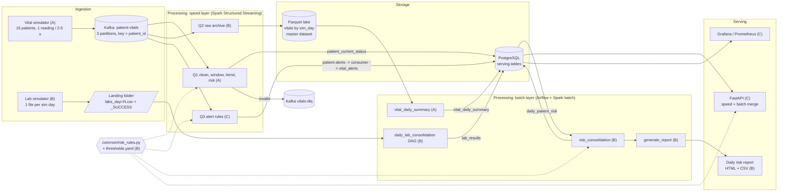
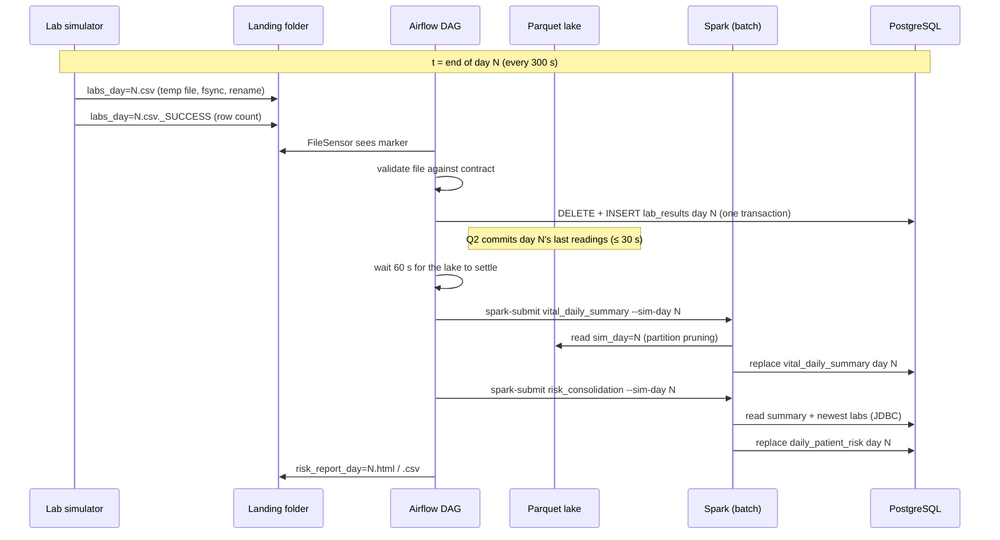
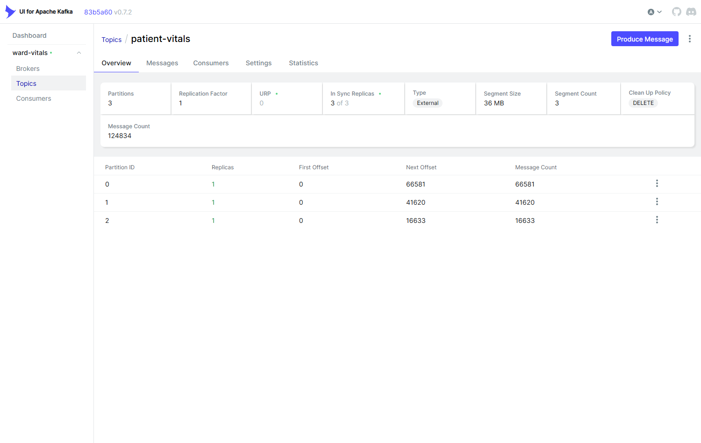
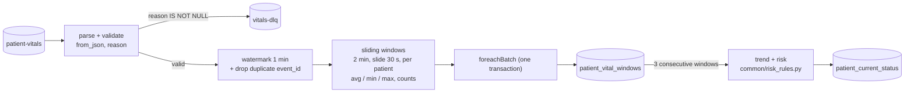
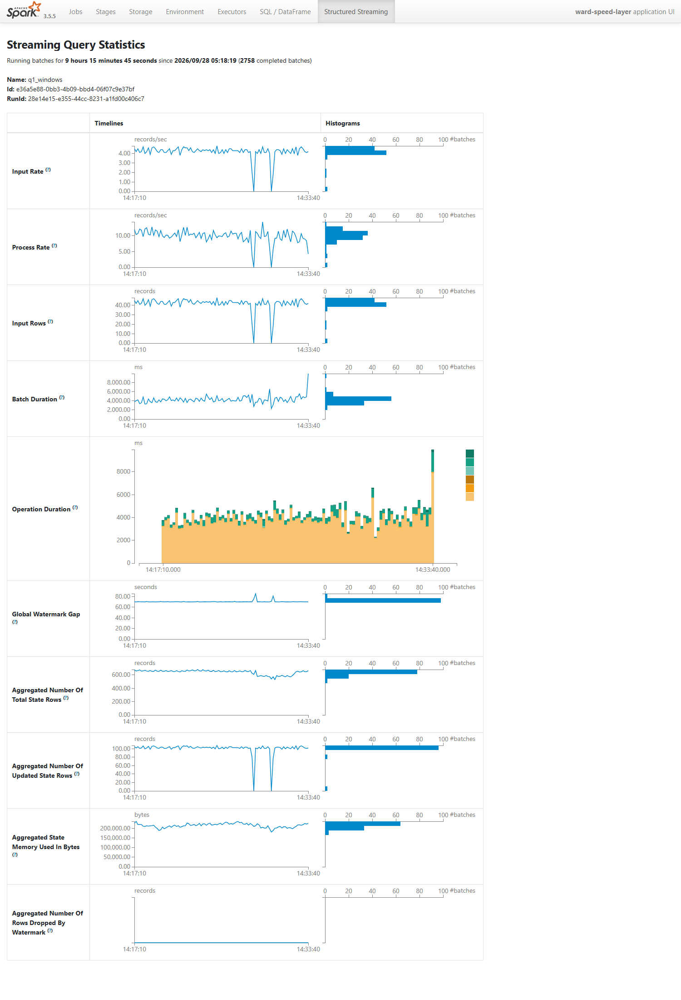
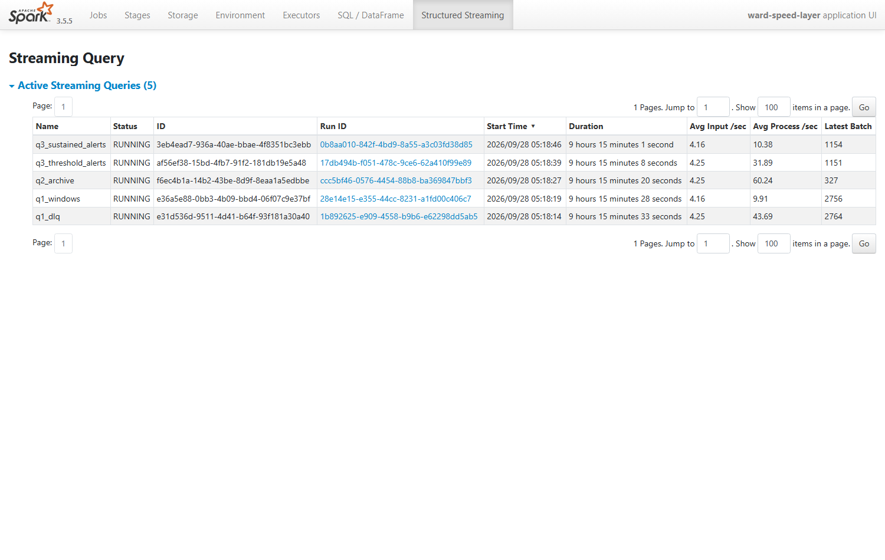
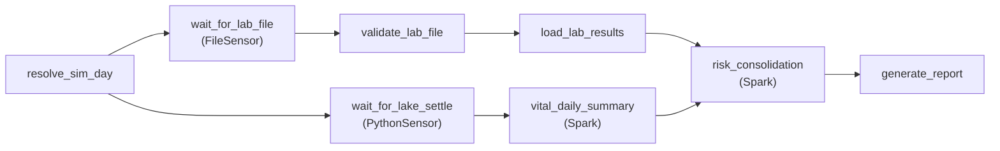

# Ward Vitals Pipeline: a Lambda Architecture for Hospital Patient Vital-Signs Monitoring

**EC8203 Applied Big Data Engineering · Mini-project · Use case 2: Hospital Patient Vital Signs Monitoring**

**Team:** Ninada (Member A) · Imalsha (Member B) · Kasun (Member C)

**Repository:** `<repository URL>` · **Demo video:** `<link>` · **Submitted:** 5 October 2026

> Risk thresholds in this project are simulated rules for a data-engineering exercise. They are **not clinical guidance**.

<!-- Assembly note (remove before export): §2, §3, §6, §7a are Member A's text (docs/report/member_a_sections.md);
§4, §7b, §8a, §10 are Member B's (member_b_sections.md); §5, §8b, §9, §11 are drafts for Member C to review;
§1, §12 and the contributions statement are for all three members to review. -->

## Contents

1. Introduction
2. Business requirements
3. Architecture decision: Lambda vs Kappa
4. Architecture
5. Technology stack and justification
6. Data design
7. Processing: 7a Streaming · 7b Batch
8. Storage and serving: 8a Storage · 8b Serving
9. Observability
10. Results
11. Limitations, trade-offs and production scale
12. Conclusion
- Individual contributions
- Appendix A: Reproducing the results

---

## 1. Introduction

A hospital ward monitors patients through bedside sensors that report vital signs every few
seconds, while the pathology lab publishes blood-test results once a day. Clinically, the two only
make sense together: a raised heart rate means more when the same patient's lactate and CRP are
high. This project builds a data platform that ingests both sources, processes the stream in near
real time, joins it daily with the lab results, and serves the combined picture through an API, a
daily report and a monitoring dashboard.

The system is an end-to-end **Lambda architecture** on Apache Kafka, Apache Spark (Structured
Streaming and batch), Apache Airflow, a Parquet data lake and PostgreSQL, with Prometheus and
Grafana for observability. Everything runs from one Docker Compose file. The report explains the
architecture decision (§3), the design (§4–§8), how the running system is observed (§9), what it
produces (§10), and where it falls short of a production system (§11).

---

## 2. Business requirements

**Use case 2: Hospital Patient Vital Signs Monitoring.** A ward of 15 patients wears bedside monitors
that report heart rate, SpO₂, blood pressure and temperature every few seconds. Once a day the
pathology lab delivers a file of lab results. The ward asks two questions:

1. *Which patients show concerning vital-sign trends right now?* (seconds matter)
2. *How do yesterday's lab results change the risk picture for those patients?* (once a day)

We read these questions as the requirements below. Each one names the component that meets it and,
where we measured it, the result.

| # | Requirement | Interpretation | Met by | Result |
|---|---|---|---|---|
| R1 | Near-real-time ward view | Every patient's latest vitals, risk and trend visible within seconds of the reading | Q1 → `patient_current_status` → API (§7a) | Reading to table: 6.2 s on average, 9 s at worst |
| R2 | Per-patient threshold alerts | An alert for every reading outside a limit, and a stronger alert when the limit stays broken | Q3 → `patient-alerts` → `vital_alerts` (§8b) | P007 spike: `CRITICAL` alert through the API |
| R3 | Concerning **trends**, not only single values | Heart rate rising or SpO₂ falling across three consecutive windows, beyond sensor noise | Q1 trend (§7a.5) | SpO₂ drop marked `FALLING` 75 s after it started |
| R4 | Daily lab feed | One file per simulated day, loaded completely or not at all | Lab DAG (§7b) | Day 68: 80 of 80 rows loaded; a bad file rejected with 0 rows loaded |
| R5 | Daily consolidated risk | Per patient: vital points plus lab points from the newest labs (today or yesterday) → NORMAL / WATCH / CONCERNING | Risk join and report (§7b, §10) | Day 85: labs moved 3 patients from WATCH to CONCERNING |
| R6 | Queryable serving | An API for the live ward view and a merged speed + batch view per patient | FastAPI (§8b) | |
| R7 | Recompute history | A rule change or bug fix can be applied to past days | Parquet lake + batch jobs (§3, §8a) | Re-running a day gives identical rows |
| R8 | Trustworthy data | Invalid readings never reach the ward view but are kept for diagnosis; no double counting | Validation, dead-letter topic, de-duplication (§7a.2) | |
| R9 | Observable pipeline | Structured logs, metrics and at least one health alert | §9 | |

**Assumptions and simplifications.**
- **Not clinical.** The risk rules (`config/thresholds.yaml`) are project-defined for a
  data-engineering exercise. They are not clinical guidance.
- **Simulated time.** One simulated day lasts 300 real seconds (§4.1), so "yesterday's labs"
  are 5 minutes old.
- **One node.** The system runs on one laptop with a single Kafka broker, so replication is 1.
  The design choices are argued for a real ward, and §11 lists what changes at production scale.

---

## 3. Architecture decision: Lambda vs Kappa

**Decision: Lambda.** A speed layer (Spark Structured Streaming) serves question 1 from the vital
stream. A batch layer (Airflow + Spark batch) serves question 2 by recomputing daily views from an
immutable master dataset and the lab file. The serving layer merges the two. Kappa is the rejected
alternative.

### 3.1 The two candidates, concretely

**Lambda (built).** Every reading goes to Kafka. Three streaming queries read it: Q1 (live ward
view), Q3 (alerts) and Q2, which archives every event, valid or not, to a Parquet lake partitioned
by simulated day. Once a day, Airflow waits for the lab file, loads it, recomputes the day's vital
summary from the lake and joins it with the newest labs (Figure 4.1).

**Kappa (rejected).** Kafka's log would be the only source of truth. The lab file would be
published to a `lab-results` topic. One streaming job would compute the live view *and* the daily
view: a day-long event-time window per patient, joined with a stream of lab results. To change a
rule, a new version of the job would replay the topic from the start into new tables, and the
serving layer would switch over when it caught up.

### 3.2 Comparison on the four criteria

| Criterion | What the use case needs | Lambda (ours) | Kappa |
|---|---|---|---|
| **Latency** | Live view in seconds; daily view once a day | Speed layer: 6.2 s average from reading to table. Daily view ready about 1–2 min after the day ends | Same live latency. The daily view is also streaming, so it can update during the day, but "yesterday" is only final once the day's window closes |
| **Replay** | Recompute any past day after a rule change or bug fix | The lake keeps every raw event (and the raw payload) indefinitely. Recomputing day N reads one partition (`sim_day=N`); our summary job takes about 43 s per day and gives identical rows on a re-run | Replay is bounded by Kafka retention (7 days here). History beyond it is lost unless retention is unlimited, which makes the broker the long-term store. The lab file is not in Kafka at all unless we add a topic for it |
| **Consistency** | The daily risk must be complete and repeatable; the live view may be approximate | The batch view counts every event, including readings that arrived too late for the speed layer's 1-minute watermark. Days are replaced atomically, so a re-run gives the same answer | One job, one code path, so no drift between layers. But the daily answer is only as complete as the stream's watermark allows: a late reading is dropped for good unless the watermark is widened, which holds state longer |
| **Cost** | Small team, two weeks, one laptop | Two processing paths to build and run. We limit the logic cost with one shared rules module (§7b.4), and the batch path is cheap: it runs once per simulated day | One codebase and one runtime. But the daily join needs a day of state per patient in the streaming job, and every reprocessing replays and recomputes the whole topic |

### 3.3 Why Lambda fits this use case

1. **Half the data is a daily file.** The lab feed has batch semantics. It is complete only when
   the whole file has arrived (the `_SUCCESS` marker), it can be late or missing, and a bad file
   must be rejected as a whole. Airflow's FileSensor, validation, retries and failure callbacks
   (§7b.2) model this directly. In Kappa, the file would have to be turned into a stream, and a
   streaming job would then have to rebuild the idea of "the file for day N is complete". That is
   the batch layer again, rebuilt inside a streaming job.
2. **The question has two time scales.** Question 1 needs an answer in seconds and can accept an
   approximation. Question 2 is asked once a day and must be complete and repeatable, because it
   is a report that people act on. Lambda gives each question its own path with the right trade-off.
3. **Replay beyond Kafka retention.** Rules in a monitoring system change, and when they do the
   ward wants past days recomputed. The Parquet lake keeps the raw events and costs nothing to keep.
   Partitioning by `sim_day` means one day is recomputed by reading one folder. Kafka can seek by
   timestamp too, but only within its retention period.
4. **The brief asks for orchestrated historical reporting.** A scheduled daily job with a DAG,
   retries and a report file is the batch layer. Kappa would need a separate scheduler for the
   report anyway.

### 3.4 Rejected alternative: when Kappa would win

Kappa would be the better choice if the labs arrived as individual result events (for example HL7
messages as each test finishes) rather than as a daily file, if long Kafka retention (or tiered
storage) were available, and if the team could afford only one runtime. In that world the second
code path would buy little. It is not our world: the brief fixes the lab source as a daily file.

### 3.5 Trade-offs we accept, and how we contain them

| Lambda weakness | How it shows up here | Mitigation |
|---|---|---|
| The same logic is written twice and drifts apart | "Abnormal" and "risk" are needed in Q1, Q3, the daily summary, the risk join and the API | One rules module built from one `thresholds.yaml`, as Python and as Spark expressions, with parity tests (§7b.4). The daily summary reuses Q1's `is_abnormal()` |
| Two answers to one question | Live vital risk comes from a 2-minute window; daily vital risk from the whole day, so a patient can be NORMAL now and WATCH for the day | Both are shown, labelled by source: the API's merged view returns `speed_view` and `batch_view` separately (§8b) |
| Batch results are not live | Day N's risk appears 1–2 minutes after the day ends | Acceptable for a daily report; the live question is answered by the speed layer |
| More moving parts | Kafka, Spark streaming, Spark batch, Airflow, Postgres | One Compose file with pinned versions; health alerts on each layer (§9) |
| Both layers compete for one machine | On a 4 GB laptop a daily run occasionally took longer than a simulated day (§10.4) | Each Spark app is capped at 2 cores; the DAG skips ahead rather than queueing (§7b.1) |

---

## 4. Architecture

The pipeline follows the Lambda architecture chosen in §3: a **speed layer** turns the vital-sign
stream into live patient status and alerts within seconds, a **batch layer** recomputes a daily
risk view from an immutable master dataset and the daily lab file, and a **serving layer** merges
both views. Figure 4.1 shows every component, grouped by layer, with the member who built it.

**Figure 4.1: Component architecture (ingestion, processing, storage, serving).**



Three design choices shape the diagram:

1. **One master dataset.** Q2 archives every Kafka event, including invalid ones, to a Parquet lake
   partitioned by simulated day. The batch layer reads only the lake, never Kafka, so any day can be
   recomputed after a rule change or a bug fix. This is the "replay" property that motivated Lambda (§3).
2. **One set of rules for both layers.** The dashed lines in Figure 4.1 show the single rules module
   imported by Q1, Q3, the risk join and the API. It is the project's answer to Lambda's main weakness,
   duplicated logic that drifts apart (§7b.4).
3. **Files are handed over through a contract, not by timing.** The lab simulator writes each file
   atomically and then a `_SUCCESS` marker; Airflow waits for the marker. Producer and consumer share
   the same contract module (`common/lab_feed.py`).

### 4.1 Simulated clock

One simulated day lasts **300 real seconds**. Every component computes
`sim_day = floor((t − SIM_EPOCH) / 300)` through the shared `common/sim_clock.py`, with `SIM_EPOCH`
and the day length read from one configuration (`config/app.yaml`, overridden by `.env`). A reading's
`sim_day` comes from its event time; a lab file's day is fixed when the simulator writes it.

### 4.2 One simulated day, end to end

**Figure 4.2: What happens when simulated day N ends.**



### 4.3 Deployment

All services run under one Docker Compose file with pinned versions: Kafka 3.9 (KRaft), Spark 3.5.5
standalone (one master, one 4-core worker), Airflow 2.10.5 (LocalExecutor), PostgreSQL 16, FastAPI,
and a `monitoring` profile with Prometheus, Pushgateway, kafka-exporter and Grafana. The streaming
application and each batch job are capped at 2 Spark cores, so a daily job can run next to the
long-running streaming queries on a single worker. Airflow submits Spark jobs in client mode (the
driver runs in the Airflow container, the executors on the Spark worker).

---

## 5. Technology stack and justification

| Layer | Choice | Why this tool for this use case | Considered instead |
|---|---|---|---|
| Ingestion | **Apache Kafka 3.9** (KRaft), topic `patient-vitals` with 3 partitions | Keying by `patient_id` keeps each patient's readings **in order** on one partition while spreading patients across partitions. Durable log with 7-day retention decouples the bedside producer from processing and allows replay. A separate DLQ topic holds invalid events. | Direct writes to a database: no replay, and the producer would block on the consumer. |
| Stream processing | **Spark Structured Streaming 3.5** | Event-time windows with watermarks for late data, `dropDuplicatesWithinWatermark` for de-duplication, exactly-once file sink for the archive, and `foreachBatch` for idempotent upserts. **The same engine runs the batch jobs**, so the risk rules are written once as Spark expressions and reused in both layers. | Apache Storm: no shared batch engine, so the rules would be written twice. |
| Batch processing | **Spark batch** (same cluster) | Reads the Parquet lake with partition pruning; JDBC access to PostgreSQL; window functions for "newest labs per patient". | Pandas in Airflow: fine at 15 patients, but does not scale and would duplicate the Spark rules. |
| Orchestration | **Apache Airflow 2.10** | The lab source is a daily file: Airflow provides a FileSensor, retries, failure callbacks, a schedule aligned to the simulated day, reruns of any day by parameter, and a UI with task logs. | Cron: no sensors, dependencies, retries or visibility. |
| Master dataset | **Parquet lake**, partitioned by `sim_day` | Columnar and compressed; batch jobs read a few columns over many rows; Hive-style partitions give pruning by day; immutable files make recomputation safe. | Keeping history in PostgreSQL: expensive and row-oriented for analytical scans. |
| Serving store | **PostgreSQL 16** | Small, query-heavy serving tables; transactions make "replace day N" atomic; upserts (`ON CONFLICT`) make the streaming sinks idempotent; check constraints enforce data rules; one database also hosts Airflow's metadata. | Cassandra: built for write-heavy scale we do not have, and without transactions or joins. |
| Serving API | **FastAPI** | Lightweight, typed, automatic OpenAPI docs at `/docs`, easy to test with `TestClient`. | — |
| Observability | **Prometheus, Pushgateway, kafka-exporter, Grafana**; JSON logs | Pull-based metrics for long-running services; Pushgateway for short-lived batch tasks and the Spark driver; kafka-exporter for topic offsets and consumer lag; alert rules in version control; one Grafana dashboard. | — |
| Packaging | **Docker Compose**, pinned image tags | One command reproduces the system on any laptop; pinned versions keep Spark, the Kafka connector and Airflow's `pyspark` identical. | — |

---

## 6. Data design

### 6.1 Vital-sign event

One JSON object per reading, produced by `simulators/vital_producer/main.py`:

| Field | Type | Example | Notes |
|---|---|---|---|
| `event_id` | UUID string | `67406ac3-…` | Unique per reading and per run; used for de-duplication and alert ids |
| `patient_id` | string | `P007` | Kafka message key |
| `bed_id` | string | `BED-07` | Fixed per patient |
| `heart_rate` | int, bpm | `82` | Valid range 20–250 |
| `spo2` | float, % | `96.8` | Valid range 50–100 |
| `systolic_bp`, `diastolic_bp` | int, mmHg | `121`, `79` | Valid 50–260 and 20–160 |
| `temperature` | float, °C | `36.9` | Valid 30–45 |
| `timestamp` | ISO 8601, UTC, ms | `2026-09-28T08:00:03.412+00:00` | **Event time**: all windows and `sim_day` use it |

The *valid ranges* are physical plausibility limits: a value outside them is a sensor or
transmission error and is rejected to the dead-letter topic. They are separate from the *clinical
thresholds* in `thresholds.yaml`, which only mark a valid reading as abnormal.

**Simulator.**
- **Patients.** 15 patients (P001–P015), each with a random resting baseline and Gaussian noise.
  Each patient reports on its own 2–5 s rhythm, scheduled by one min-heap.
- **Spikes.** 3 % of readings are single abnormal spikes on one vital.
- **Seeding.** The values come from a seeded generator (`--seed`); only the timestamps and
  `event_id`s change between runs.
- **Demo scenarios (A8).** `spike`, `hr_spike`, `spo2_drop` and `outage` are also seeded. The same
  seed gives the same alerts: two live runs raised the same 48 threshold alerts, at the same offsets
  to within 4 ms.
- **Malformed events.** `--malformed-rate` injects bad events (missing field, null, wrong type,
  out of range, invalid JSON) to exercise the dead-letter path.

### 6.2 Kafka topics and producer

| Topic | Partitions | Key | Content | Written by → read by |
|---|---|---|---|---|
| `patient-vitals` | 3 | `patient_id` | Raw readings | Producer → Q1, Q2, Q3 |
| `vitals-dlq` | 1 | `patient_id` | Rejected readings with `reason`, raw payload, source partition and offset | Q1 → operators |
| `patient-alerts` | 3 | `patient_id` | Alerts | Q3 → alert consumer |

- **Retention.** 7 days (`KAFKA_LOG_RETENTION_HOURS=168`), so any recent period can be replayed
  from Kafka as well as from the lake.
- **Replication.** The replication factor is 1, because there is a single broker.

**Why the key is `patient_id`.** Kafka keeps order only within a partition. Keying by patient puts
all of a patient's readings on one partition, in order. Q1's windows, the trend and Q3's sustained
alerts are all per patient, so per-patient order is the order that matters.

**Producer settings.**
- **`acks=all`.** The leader acknowledges a write only once it is replicated.
- **`enable.idempotence=true` with 10 retries.** A retried batch is written once, not twice.
- **`linger.ms=20`.** Small batches, at a tiny latency cost.
- **`murmur2` partitioner.** The same hash as the Java client, so any client would place a patient
  on the same partition.
- **Delivery callback.** Each message's callback counts it as sent or failed in Prometheus metrics
  (§9) and warns if a patient ever changes partition.

**Observed partition layout** (Figure 6.1):

| Partition | Patients | Messages (at capture) |
|---|---|---|
| 0 | P003, P005, P008, P009, P010, P012, P013, P014 | 66,581 |
| 1 | P002, P006, P007, P011, P015 | 41,620 |
| 2 | P001, P004 | 16,633 |



*Figure 6.1: Messages per partition of `patient-vitals` in Kafka UI.*

Each patient stayed on one partition for the whole run, as intended.

**Skew.** The load is uneven, 8/5/2 patients per partition: hashing 15 keys into 3 buckets is
lumpy. At this volume it does not matter; the lag stayed at 0. On a real ward with hundreds of
patients the hash evens out. For a small, fixed set of keys, a custom partitioner or more
partitions than consumers would reduce the skew.

### 6.3 Simulated clock in the data

`sim_day` is derived from **event time**, never from arrival time, through
`common/sim_clock.sim_day_column()`, the same function in Q1, Q2 and Q3 (§4.1). A reading produced
at 23:59:59 of a simulated day therefore belongs to that day even if Spark processes it after
midnight. The lake partition, the daily summary and the risk join all agree on which day it is.

Readings older than `SIM_EPOCH` get negative day numbers. This happened once, after Q2's first start
from the earliest Kafka offset picked up test data from the day before the epoch. Those days are
never requested by the DAG, so they are harmless, but a production system would reject events
before its epoch.

### 6.4 Tables written by the vitals slice

| Table | Grain | Key columns | Main columns |
|---|---|---|---|
| `patient_current_status` | 1 row per patient (the live view) | `patient_id` | Current 2-min window; avg/min/max of each vital; `reading_count`, `abnormal_count`; `hr_trend`, `spo2_trend`; `vital_risk_score`, `vital_risk_category`; `sim_day`; `updated_at` |
| `patient_vital_windows` | 1 row per patient per window, last 10 min | `patient_id, window_start` | `avg_heart_rate`, `avg_spo2`, `reading_count`: the history the trend needs (§7a.5) |
| `vital_daily_summary` | 1 row per patient per simulated day | `sim_day, patient_id` | Daily avg/min/max of each vital, `reading_count`, `abnormal_count`, `computed_at` |

**Dead-letter record** (`vitals-dlq`):

```json
{"reason": "missing_or_null:heart_rate", "raw": "<original Kafka value>",
 "source_partition": 1, "source_offset": 40211, "detected_at": "..."}
```

`reason` names the first failed check (`malformed_json`, `wrong_type`, `missing_or_null:<fields>`,
`bad_timestamp`, `out_of_range:<fields>`), and the partition and offset point back to the original
message. In the run above, the 17 dead-lettered events were 6 missing or null, 5 wrong type,
3 malformed JSON and 3 out of range.

---

## 7a. Streaming processing

The speed layer is one Spark application (`spark/streaming/app.py`) running five streaming queries
on the `patient-vitals` topic. Each query has its own checkpoint, so each one restarts from exactly
where it stopped.

| Query | Owner | Trigger | Output |
|---|---|---|---|
| `q1_windows` | A | 10 s | `patient_current_status`, `patient_vital_windows` |
| `q1_dlq` | A | 10 s | Kafka `vitals-dlq` |
| `q2_archive` | B | 30 s | Parquet lake (§8a) |
| `q3_threshold_alerts`, `q3_sustained_alerts` | C | 10 s | Kafka `patient-alerts` (§8b) |

**Figure 7a.1: Q1, from Kafka to the live ward view.**



### 7a.1 Parse and validate

- **Parsing.** `from_json` parses each message against an explicit schema, with a
  corrupt-record column that catches broken JSON and wrong types.
- **Rejection reason.** A single `reason` expression checks, in order: malformed JSON, wrong type,
  missing or null fields, unparseable timestamp, and values outside the plausible ranges (§6.1).
  The first failed check becomes the reason, so every rejected event has exactly one.
- **Dead-letter topic.** A second query writes rejected events, with their raw payload, to
  `vitals-dlq` [Screenshot: DLQ messages in Kafka UI]. Nothing is dropped silently. Q2 archives
  rejected events too, so they can be reprocessed if the rules change.

### 7a.2 Event time, watermark and de-duplication

- **Event time.** Windows are computed on `timestamp`, not on arrival time. A reading delayed in
  the network still lands in the window it belongs to.
- **Watermark.** The watermark is 1 minute behind the newest event seen. Readings older than that
  are dropped, and window and de-duplication state older than that is discarded, so memory stays
  bounded. In the Spark UI, state stays flat at about 600 rows and the watermark gap at about 70 s
  (Figure 7a.2).
- **De-duplication.** `dropDuplicatesWithinWatermark(["event_id"])` removes re-delivered readings;
  a producer retry or a replayed batch cannot count twice.
- **Tested.** A streaming unit test runs Q1's real code over two micro-batches. A duplicate is
  counted once, a reading 3 minutes late changes no window, and a duplicate arriving in a later
  batch changes nothing (`tests/slice_a/test_q1_windows.py`).



*Figure 7a.2: Q1 in the Spark Structured Streaming UI: input rate, state rows, watermark gap.*

### 7a.3 Sliding windows

Per patient, a **2-minute window sliding every 30 s** computes, for each vital:
- the average, minimum and maximum;
- `reading_count`, and `abnormal_count` (readings beyond the thresholds).

Two minutes hold 25–60 readings, enough to smooth noise while still reacting within a minute. The
30-second slide means each reading sits in four overlapping windows.

The query runs in **update** output mode: each micro-batch emits only the windows that changed.

The live view shows, for each patient, the window that ends with the patient's latest reading:
among the four windows holding that reading, the earliest-starting one. That window covers the
fullest two minutes of history.

### 7a.4 Sink: `foreachBatch` in one transaction

Each micro-batch runs, in **one PostgreSQL transaction**:
1. Upsert every changed window into `patient_vital_windows`.
2. Read back the recent windows of the batch's patients, and compute trend and risk (§7a.5–7a.6).
3. Upsert one row per patient into `patient_current_status`. The upsert has a guard,
   `WHERE last_event_time <= EXCLUDED.last_event_time`, so a late batch never replaces a newer
   window with an older one.
4. Delete windows older than 10 minutes.

**Effectively exactly-once.** The checkpoint records the Kafka offsets of every batch. After a
crash, Spark re-runs the unfinished batch. Every statement above is an upsert or a deletion by age,
so re-running a batch leaves the tables exactly as one run would. Kafka offsets in the checkpoint,
plus an idempotent sink, give exactly-once *results* even though the sink itself is at-least-once.

### 7a.5 Trend across micro-batches

A micro-batch only emits the windows it touched, so it cannot see three consecutive windows by
itself. Q1 therefore keeps the last 10 minutes of windows in `patient_vital_windows` and reads them
back.

**Rule** (`trend_label`). Take the three windows ending at the current one, exactly 30 s apart.
- **RISING:** each window's average is higher than the one before, and the total rise is at least
  the minimum change.
- **FALLING:** the mirror image.
- **STABLE:** anything else.
- **No trend (NULL):** fewer than three consecutive windows, for example after the producer
  stopped.

The minimum change (heart rate 5 bpm, SpO₂ 1 point; in `thresholds.yaml`) matters. Overlapping
windows share 75 % of their readings, so random noise alone often produces three small rises in a
row. Without a minimum, the trend would flicker.

**Result.** In the `spo2_drop` scenario, P007's SpO₂ was marked `FALLING` 75 s after the decline
began, and heart rate `RISING` 30 s later.

### 7a.6 Vital risk

Each current window is scored with the shared rules (`common/risk_rules.py`):
- SpO₂ below 92: 2 points.
- Heart rate outside 50–120: 1 point.
- Temperature above 38.0: 1 point.
- Systolic pressure outside 90–160: 1 point.
- A rising heart rate or falling SpO₂ trend: 1 point.

The total maps to NORMAL (0–1), WATCH (2–3) or CONCERNING (4 or more). These are the same rules
the batch risk join and the API use (§7b.4).

**Result.** In the Checkpoint 1 run, P007's `spike` scenario took P007 to the top of
`/api/patients?sort=risk` as CONCERNING, 4 points (low SpO₂, high heart rate, trend), with
CRITICAL sustained alerts from Q3.

### 7a.7 Measured behaviour

From the application's own progress logs over 30 minutes (180 micro-batches per query) on the
development laptop:

| Query | Median batch | 95th percentile | Max Kafka lag | Rows dropped by watermark |
|---|---|---|---|---|
| `q1_windows` | 4.0 s | 4.9 s | 0 | 0 |
| `q1_dlq` | 0.9 s | 1.6 s | 0 | – |
| `q2_archive` | 2.1 s | 2.5 s | 0 | – |
| `q3_threshold_alerts` | 1.4 s | 1.8 s | 0 | – |
| `q3_sustained_alerts` | 3.8 s | 4.7 s | 0 | 0 |

**Freshness.** In `patient_current_status`, `updated_at` was on average 6.2 s after the reading's
event time, and at most 9 s. Every batch finished well inside its 10 s trigger, and the lag stayed
at zero: the speed layer keeps up with the ward with room to spare.
(Figure 7a.3).



*Figure 7a.3: The five active streaming queries of the speed layer.*

### 7a.8 Limits of this design

These points feed into §11.
- **Driver-side sink.** The sink collects at most 15 rows per batch to the driver and writes them
  with psycopg2. That is right for one ward, but for thousands of patients it would become a
  JDBC bulk write into a staging table plus a `MERGE`.
- **Trend history in Postgres.** Keeping the trend history in Postgres couples the streaming job to
  the database. Spark's arbitrary stateful processing (`applyInPandasWithState`) could keep the
  last three windows in the checkpointed state instead, at the cost of more complex code.
- **Watermark trade-off.** A reading more than 1 minute late never reaches the live view. It still
  reaches the lake and the daily summary, which is exactly the consistency trade-off argued in §3.

---

## 7b. Batch processing

The batch layer answers the second half of the business question: *how do the latest lab results
change each patient's risk?* It is one Airflow DAG, `daily_lab_consolidation`, that runs once per
simulated day and carries a lab file all the way to the daily report (Figure 7b.1).

**Figure 7b.1: The DAG. [Screenshot: Airflow graph view of a successful run]**



### 7b.1 Which day a run processes

The DAG is scheduled every 300 s from `SIM_EPOCH`, so each run's data interval matches one
simulated day. A scheduled run processes the day that has just ended; a manual run accepts
`{"sim_day": N}` to process or re-run any day. With `catchup=False` and `max_active_runs=1`, a run
that takes longer than one simulated day makes Airflow skip ahead to the latest day instead of
building an ever-growing queue; a skipped day can be re-run by hand.

### 7b.2 Lab branch: sense, validate, load

- **Sensing.** A FileSensor waits for `labs_day=N.csv._SUCCESS`, not for the CSV. The simulator
  writes the CSV to a hidden temporary file, flushes it to disk, renames it (an atomic operation) and
  only then writes the marker, so the DAG can never read a half-written file. The sensor runs in
  `reschedule` mode, freeing its worker slot between checks, and fails after two simulated days: the
  "lab file missing" case.
- **Validation.** Every row is checked against the shared contract: exact header; numeric,
  finite, non-negative results; a known test type; a well-formed patient id; a non-empty unit;
  `reference_low ≤ reference_high`; a timezone-aware `collected_at` inside day N; no duplicate
  (patient, test, time). The number of data lines must equal the count in the marker, which catches
  a truncated copy. One bad row fails the whole file, and the task fails **without retries**:
  retrying cannot repair bad data.
- **Loading.** `DELETE` of day N followed by `INSERT` of the file's rows, **inside one transaction**.
  A re-run leaves exactly one copy of the day; a failure half-way rolls back to the previous state.
  Transient database errors are retried twice.

### 7b.3 Vitals branch: daily summary from the lake

`vital_daily_summary` (Member A) is a Spark batch job over the Parquet lake. It reads only
partition `sim_day=N` of valid events, removes repeated `event_id`s, and writes per-patient daily
averages, minima, maxima, reading counts and abnormal counts. Because Q2 commits to the lake every
30 s, the last readings of day N arrive shortly after the day boundary; a PythonSensor therefore
waits until 60 s after day N ends before the summary starts.

### 7b.4 Risk consolidation: the join

`risk_consolidation` is a Spark job that reads `vital_daily_summary` and `lab_results` from
PostgreSQL over JDBC and produces one row per patient in `daily_patient_risk`:

1. **Newest labs per patient.** A window function takes, for each patient, the newest lab day
   within `[N − 1, N]`. A patient missing from today's file therefore falls back to yesterday's
   results, and `lab_sim_day` records which day was used. Older results are treated as stale.
2. **Scores.** Lab points (+1 out of range, +2 beyond 1.5× the limit) are summed per patient and the
   abnormal tests listed (e.g. `crp:HIGH,lactate:HIGH`). Vital points and their reasons are computed
   from the daily summary.
3. **Left join over the whole ward.** Every patient gets a row. A patient without recent labs is
   `LAB_UNAVAILABLE` with a NULL lab score, never 0, and the total then counts vitals only. An
   inner join would have silently dropped these patients.
4. **Category.** total = vital points + lab points: 0–1 NORMAL, 2–3 WATCH, ≥ 4 CONCERNING.

All scoring goes through `common/risk_rules.py`, which builds every rule twice from the same
`thresholds.yaml`: as plain Python (used by the API and the report) and as Spark column expressions
(used by Q1, Q3 and this job). Parity tests run several hundred input combinations through both forms
and require identical points and reasons. The speed and batch layers therefore cannot disagree about
what "concerning" means, which removes the main maintenance risk of Lambda.

### 7b.5 Report

`generate_report` renders `daily_patient_risk` for day N as a self-contained HTML page and a CSV
file (§10). Next to each patient's combined category it shows the category from vitals alone, so
the reader sees directly where lab results changed the picture, plus the change since yesterday
and the day's speed-layer alert count. Files are written atomically; a re-run replaces them.

### 7b.6 Failure handling and observability

Every task failure writes a `FAIL` row to `pipeline_health` through an `on_failure_callback`; the
API exposes these rows and Prometheus alerts on them. All tasks and jobs log one JSON object per event
through the shared logger. The lab tasks push rows loaded, schema errors, file arrival time and load
duration to the Pushgateway, and the lab simulator serves `/metrics` for scraping. Two alert rules
belong to this layer: **LabFileInvalid** (the last file failed validation) and **LabFeedStopped**
(no new lab file for two simulated days), alongside the team's **LabFileLate** rule on `lab_results`.

---

## 8a. Storage

The system uses two stores with different jobs: a **Parquet lake** as the immutable master dataset,
and **PostgreSQL** as the queryable serving store.

### 8a.1 Parquet lake (master dataset)

| Property | Design |
|---|---|
| Location | `/data/lake/vitals/`, a Docker volume shared by Spark and Airflow |
| Layout | Hive-style partitions `sim_day=N/part-*.parquet` |
| Content | Every Kafka event: parsed fields, Q1's validity `reason` (NULL = valid), the original raw payload, Kafka partition and offset, ingest time |
| Writer | Q2, a Spark file sink with a 30 s trigger and its own checkpoint |
| Readers | `vital_daily_summary`, and any recomputation, through `read_lake()` |

Partitioning by simulated day matches the batch access pattern: a daily job filters `sim_day = N`,
which Spark turns into **partition pruning**, so only that day's folder is scanned. Keeping invalid
events and the raw payload means a day can be reprocessed if the validation rules change; nothing
is ever updated in place. Parquet was chosen over row formats because the batch jobs read a few
columns across many rows, and its columnar compression keeps a day of readings small.

**Exactly-once.** The checkpoint stores the Kafka offsets of each micro-batch, and the file sink
lists the files of every committed batch in `_spark_metadata`. After a crash Spark re-runs the
unfinished batch; files from the failed attempt are not in the log. Readers must therefore read the
lake root, which follows the log, rather than a partition folder directly; `read_lake()` does this.

### 8a.2 PostgreSQL (serving store)

| Table | Written by | Key | Re-run behaviour |
|---|---|---|---|
| `patient_current_status` | Q1 (speed) | `patient_id` | Upsert: newest window wins |
| `patient_vital_windows` | Q1 (speed) | `patient_id, window_start` | Upsert |
| `vital_alerts` | Alert consumer (speed) | `alert_id` (deterministic) | Duplicate key skipped |
| `lab_results` | Lab DAG (batch) | `sim_day, patient_id, test_type, collected_at` | Day replaced in one transaction |
| `vital_daily_summary` | Spark batch (A4) | `sim_day, patient_id` | Day replaced in one transaction |
| `daily_patient_risk` | Spark batch (B8) | `sim_day, patient_id` | Day replaced in one transaction |
| `pipeline_health` | DAG callbacks, checks | `id` | Append-only log |

Every writer is **idempotent**: an Airflow retry, a Spark restart or a manual re-run leaves the same
table contents as a single run. The speed-layer tables use upserts or deterministic keys; the batch
tables replace a whole day with `DELETE` + `INSERT` in one transaction, so readers see either the old
day or the new day, never a mixture.

Integrity rules live in the schema, not only in code: `lab_results` rejects NULL values and
`reference_low > reference_high`, and `daily_patient_risk` enforces
`(lab_status = 'LAB_UNAVAILABLE') = (lab_risk_score IS NULL)`, so "no labs" can never be stored as
a lab score of 0. Lineage columns (`source_file`, `loaded_at`, `lab_sim_day`, `generated_at`) record
where each row came from.

### 8a.3 Landing zone

Lab files arrive in `data/landing/labs/`, a folder shared by the simulator and Airflow. Each file is
immutable once its marker exists, and the simulator refuses to overwrite a completed day unless
forced. Rewriting a day produces a byte-identical file, because each day's content is generated from
a seed derived from the day number.

---

## 8b. Serving

**API (FastAPI).**

| Endpoint | Returns | Layer |
|---|---|---|
| `GET /health` | API up and PostgreSQL reachable (503 otherwise) | — |
| `GET /api/patients` | Every patient's current window, trend and vital risk | Speed view |
| `GET /api/patients/{id}` | Vital risk (speed) + lab risk (batch) → **combined score and category** | **Merged** |
| `GET /api/alerts` | Alerts from Q3, filterable by patient, severity, type and rule | Speed view |
| `GET /api/metrics` | JSON summary: data freshness, categories, alert counts, API traffic | Both |
| `GET /metrics` | Prometheus format | — |

`/api/patients/{id}` is where the Lambda serving layer merges the two views: the vital risk from the
latest speed window plus the lab risk from the latest batch results, combined with the same
`combine()` function the batch layer uses. Serving logic is written as pure functions (rows in,
dictionaries out) and tested with FastAPI's `TestClient`.

**Daily report.** The HTML and CSV report (§7b, §10) is the consolidated daily deliverable required by
the brief. **Dashboard.** One Grafana dashboard shows the live system (§9).

---

## 9. Observability

The pipeline is designed to be *observable*, not only functional: every stage says what it did, and
every known failure mode has a signal and, where it matters, an alert.

### 9.1 Structured logging

Every component logs through one shared logger (`common/logger.py`): one JSON object per line with
`timestamp`, `component`, `event`, `severity` and identifiers such as `patient_id` or `sim_day`, for
example:

```json
{"timestamp": "2026-09-28T06:01:36+00:00", "component": "daily_lab_consolidation",
 "event": "lab_results_loaded", "severity": "INFO", "sim_day": 71, "rows": 84, "patients": 15}
```

Airflow shows these lines unchanged in its task logs, and `docker compose logs` shows them for the
long-running services.

### 9.2 Metrics

| Component | How | Examples (`ward_` prefix) |
|---|---|---|
| Vital producer | `/metrics` (scraped) | events sent per partition, send errors, last event time |
| Lab simulator | `/metrics` (scraped) | files and rows written, newest sim day, newest file time |
| Spark streaming | Listener → Pushgateway | input vs processed rows/s, batch duration, Kafka lag, state rows, late rows dropped |
| Lab DAG tasks | Pushgateway | rows loaded, schema errors, file arrival time, load duration |
| Spark batch jobs | Pushgateway | rows written, patients per risk category, duration, last success |
| Alert consumer | `/metrics` (scraped) | alerts stored by severity, database errors |
| API | `/metrics` (scraped) | requests by route, speed-view age, patients per category, recent pipeline failures |
| Kafka | kafka-exporter | topic offsets, consumer-group lag |

Spark keeps its Kafka offsets in its checkpoint rather than a consumer group, so kafka-exporter cannot
see its lag; the listener's lag gauge closes that gap. Short-lived tasks cannot be scraped, so they push
to the Pushgateway, each under its own grouping key so that one task's push does not erase another's.

### 9.3 Alert rules

Fifteen Prometheus rules, grouped by pipeline stage:

| Stage | Rules |
|---|---|
| Ingestion | **NoVitalsReceived** (no new record on `patient-vitals` for 30 s), ProducerSendErrors, ScrapeTargetDown |
| Speed layer | **SpeedLayerStalled** (no progress for 60 s), SpeedLayerQueryStopped, SpeedLayerFallingBehind (lag > 500), SpeedViewStale |
| Alerts path | AlertConsumerLag, AlertConsumerDatabaseErrors, PatientCriticalAlert |
| Batch and storage | **LabFileLate** (yesterday's labs not loaded), **LabFileInvalid**, **LabFeedStopped**, **PipelineFailureRecorded**, PostgresDown |

In addition, every failed Airflow task writes a `FAIL` row to `pipeline_health`, a health record
visible through the API even when the monitoring profile is not running.

### 9.4 Dashboard

One Grafana dashboard, provisioned from version control, covers vitals per second, patients
CONCERNING, critical alerts, speed-view age, alert-consumer lag, Kafka throughput including the DLQ,
Spark batch duration and input vs processed rate, patients by risk category, the latest patient
alerts, firing Prometheus alerts and API traffic.

**[Screenshot 9.1: Grafana dashboard] [Screenshot 9.2: an alert firing in Prometheus]**

### 9.5 Failure drills

| Failure | How it was detected | Outcome |
|---|---|---|
| Invalid lab file (timestamps outside its day) | `validate_lab_file` failed; `pipeline_health` FAIL row with the first problems; **LabFileInvalid** | Not loaded; no retries; previous data intact |
| Kafka and the streaming app killed by the OS (memory pressure) | Containers restarted (`restart: unless-stopped`); streaming resumed from checkpoints | No lost or duplicated lake rows (§10.2) |
| First DAG run hit a date-type bug | Failure callback wrote a FAIL row with the error | Fixed; later runs succeeded |
| Producer stopped | **TODO (C11):** NoVitalsReceived firing time | |
| Database down | **TODO (C11):** PostgresDown, alert consumer retry and back-off | |
| Lab file missing | **TODO (C11):** sensor timeout, LabFileLate | |
| Malformed vitals (`--malformed-rate`) | Q1 gave each rejected event one `reason` and sent it to `vitals-dlq` with its raw payload and source offset | 17 events quarantined (6 missing or null, 5 wrong type, 3 malformed JSON, 3 out of range); none reached the ward view (§6.4) |

---

## 10. Results

Speed-layer results are reported with the design they measure: reading-to-view latency (6.2 s average, 9 s worst), batch durations and Kafka lag in §7a.7, trend detection in §7a.5 and the P007 scenario in §7a.6. This section covers the consolidated daily output and the correctness evidence across both layers.

All results below come from the running pipeline on one laptop (Docker Desktop, 4 GB assigned),
simulated clock 1 day = 300 s, 15 patients.

### 10.1 Consolidated daily risk report

The DAG produced the report for simulated day 85 without manual steps: the lab file was loaded
14 s after it appeared, and the Spark summary, risk join and report followed. Table 10.1 is an
excerpt; the complete files are in `reports/sample/`.

**Table 10.1: Daily risk report, sim day 85 (excerpt).**

| Patient | Category | Total | Vital pts (reasons) | Lab pts (abnormal labs) | Vitals alone | Labs changed |
|---|---|---|---|---|---|---|
| P007 | CONCERNING | 12 | 4 (spo2_low, temperature_high, systolic_bp_high) | 8 (creatinine, crp, lactate high; haemoglobin low) | CONCERNING | – |
| P003 | CONCERNING | 4 | 3 (spo2_low, systolic_bp_high) | 1 (lactate high) | WATCH | **WATCH → CONCERNING** |
| P006 | CONCERNING | 4 | 2 (temperature_high, systolic_bp_high) | 2 (lactate high) | WATCH | **WATCH → CONCERNING** |
| P011 | CONCERNING | 4 | 3 (spo2_low, temperature_high) | 1 (crp high) | WATCH | **WATCH → CONCERNING** |
| P012 | WATCH | 3 | 3 (spo2_low, systolic_bp_high) | 0 | WATCH | – |
| P001 | NORMAL | 1 | 0 | 1 (creatinine high) | NORMAL | – |
| P004 | NORMAL | 0 | 0 | 0 (labs from day 84) | NORMAL | – |

Day 85 summary: **5 concerning, 3 watch, 7 normal**; for **3 patients** (P003, P006, P011) the lab
results moved the category from WATCH to CONCERNING, which is the answer to the business question's
second half. P004 had no labs in day 85's file and was scored with day 84's results. P007, the demo
patient whose simulated labs always show high CRP and lactate, is the highest-risk patient of the day.

**[Screenshot 10.1: `risk_report_day=85.html` in a browser]**

### 10.2 Correctness evidence

| Claim | Evidence |
|---|---|
| The lake stores every Kafka event exactly once | 21,517 rows = 21,517 distinct (partition, offset) pairs after several streaming restarts |
| Re-running a day does not duplicate data | Day 71 loaded at 06:00:12 and re-run at 06:01:36: 84 rows both times; `daily_patient_risk` day 77 computed twice: 15 rows |
| The lab file is complete when loaded | Day 68: 80 rows loaded = 80 rows stated in the `_SUCCESS` marker |
| A bad file is rejected, not loaded | A file with timestamps outside its day failed validation once (no retries), 0 rows loaded, `pipeline_health` FAIL: "84 problems: … outside sim day" |
| Missing labs are not scored as 0 | Unit tests and a database check constraint; `LAB_UNAVAILABLE` rows carry a NULL lab score |
| Speed and batch layers use identical rules | Spark vs Python parity tests over several hundred combinations: identical points and reasons |
| The pipeline recovers from crashes | Kafka and the streaming app were killed by the OS under memory pressure; both restarted automatically and resumed from checkpoints with no lost or duplicated lake rows |

**[Screenshot 10.2: Airflow grid view with successful daily runs]**
**[Screenshot 10.3: lake folders `sim_day=N` and `_spark_metadata`]**

### 10.3 Tests

About 170 pytest test functions, many of them parametrized, run in the project's Docker images:
39 for the real-time slice (validation, windows, watermark and de-duplication in streaming mode, trend,
clock, producer and scenarios), 61 for the labs and history slice (simulator, lab-file contract, risk
rules and Spark/Python parity, lake archive with restarts, risk join, report, DAG import), 55 for alerts,
serving and observability (alert rules, alert consumer, API, listener, logger, metrics), and 13 shared
configuration checks.

### 10.4 Observations

- **Daily minima and maxima are strict.** The daily summary scores the extreme reading of the day,
  so a single transient spike (3 % of readings by design) can add points for the whole day; many
  patients show `spo2_low` on a given day. Averages or a "sustained for k readings" rule would suit a
  daily view better (§11).
- **Timing on constrained hardware.** On the 4 GB development laptop the lab branch took 14 s,
  the daily summary 1.4 min and the risk join up to 7.7 min under memory pressure, so the whole run
  occasionally exceeded one simulated day and Airflow skipped a day as designed. The demo machine
  has more memory; its timings replace these in the final version. **[TODO: measure on demo laptop]**

---

## 11. Limitations, trade-offs and production scale

### 11.1 Known limitations

| Limitation | Effect | Mitigation / next step |
|---|---|---|
| Single Kafka broker, replication factor 1 | A broker failure stops ingestion | 3 brokers, RF 3, `min.insync.replicas=2` |
| One Spark worker, one Airflow LocalExecutor | No fault tolerance for compute; batch runs compete with streaming for 4 cores | Cluster manager (Kubernetes), dedicated pools |
| Daily min/max scoring | A single spike scores for a whole day (§10.5) | Averages or "sustained for k readings" in the daily view |
| Driver-side streaming sink (§7a.8) | Q1 collects each batch to the driver; fine for 15 patients, not thousands | JDBC bulk write to a staging table plus `MERGE` |
| Trend history kept in PostgreSQL (§7a.8) | Couples the streaming job to the database | Keep the last windows in Spark state (`applyInPandasWithState`) |
| Events before `SIM_EPOCH` (§6.3) | Get negative day numbers in the lake | Reject events older than the epoch |
| Small Parquet files (30 s trigger) | Many small files per day | Periodic compaction, or a table format with compaction (Delta Lake, Iceberg) |
| Speed-vs-batch reconciliation not implemented | Drift between layers is argued, not measured | A job comparing window aggregates with the daily summary |
| No replay DAG | Recomputing a day is a manual `sim_day` trigger | A DAG that recomputes a range of days from the lake |
| Memory footprint | The full stack needs about 8–10 GB; on 4 GB, containers were killed | Separate machines per layer in production |
| Timestamp types | The shared clock rejects Airflow's pendulum dates; the DAG converts them | Normalise all datetimes inside `sim_clock` |
| No security | No authentication, encryption or audit; unacceptable for patient data | TLS, authentication on API and Kafka, encryption at rest, audit log |

### 11.2 Trade-offs we chose

- **Two layers over one.** Lambda costs a second code path and more operations; we paid this for cheap
  replay, an authoritative daily answer and a natural fit for the daily file (§3), and contained the
  drift risk with shared rules and parity tests.
- **Idempotency over exactly-once transactions.** Instead of distributed transactions, every sink is
  idempotent (upserts, deterministic keys, day replacement in one transaction). This is simpler and
  robust to retries, but relies on stable keys, which is why the producer's repeating ids matter.
- **Strict validation.** One bad row rejects a whole lab file. This favours correctness over
  availability: a day with a broken file has no lab score until the file is fixed, and the patients
  fall back to yesterday's labs or `LAB_UNAVAILABLE`.

### 11.3 At production scale

- **Ingestion:** HL7/FHIR feeds from real monitors and the laboratory system; a schema registry (Avro
  or Protobuf) with compatibility rules; more partitions keyed by patient.
- **Storage:** object storage (S3/ADLS) with Delta Lake or Iceberg for ACID tables, compaction, time
  travel and schema evolution; a managed PostgreSQL with read replicas for serving.
- **Processing and orchestration:** Spark on Kubernetes with autoscaling; Airflow with the Kubernetes
  executor; data-quality checks as a framework (e.g. Great Expectations) rather than hand-written code.
- **Observability:** Alertmanager routing to on-call staff, SLOs on data freshness, distributed
  tracing (OpenTelemetry) from reading to alert.
- **Governance:** encryption, access control and auditing for protected health information; clinically
  validated scoring (e.g. NEWS2) owned by clinicians, not engineers.

---

## 12. Conclusion

The Ward Vitals Pipeline ingests a continuous vital-sign stream and a daily lab file, and answers both
halves of the business question: the speed layer shows, within seconds, which patients' vitals are
concerning and raises alerts; the batch layer joins each day's vital summary with the newest lab results
and shows how the labs change the risk picture, as in day 85's report, where lab results moved three
patients from WATCH to CONCERNING. The Lambda architecture was chosen for the daily nature of the lab
source, cheap replay from an immutable Parquet lake and an authoritative batch view; its main weakness,
duplicated logic, was contained with one shared rules module verified by parity tests. Every sink is
idempotent, every stage logs and reports metrics, and alert rules cover the failure modes we could
identify. The main gaps are the single-node deployment, the absence of security, and a measured
speed-vs-batch reconciliation, each with a clear next step.

---

## Individual contributions

**[TODO: each member confirms their own paragraph before submission.]**

**Ninada (Member A), real-time vitals.** Simulated clock (`common/sim_clock.py`); vital-sign simulator
and Kafka producer with keyed partitioning, `acks=all`, idempotence, seeded scenarios and malformed
events; streaming query Q1 (validation, DLQ, watermark, de-duplication, sliding windows, trend, vital
risk, idempotent upserts); the `vital_daily_summary` batch job; producer metrics. Report §2, §3 (lead),
§6, §7a.

**Imalsha (Member B), labs and history.** Configuration loader (`common/config.py`); lab-file simulator
with atomic writes and the lab-file contract (`common/lab_feed.py`); PostgreSQL schema; streaming query Q2
(raw archive to the Parquet lake); shared risk rules with Spark/Python parity (`common/risk_rules.py`);
the `daily_lab_consolidation` Airflow DAG; the risk consolidation job; the daily HTML/CSV report; lab-feed
metrics, logs and alert rules. Report §4, §7b, §8a, §10.

**Kasun (Member C), alerts, serving and observability.** Shared JSON logger and metrics helpers;
streaming query Q3 (threshold and sustained alerts) and the alert consumer; `StreamingQueryListener`
metrics; the FastAPI serving layer with the speed/batch merge; Prometheus configuration and alert rules;
the Grafana dashboard; failure drills. Report §5, §8b, §9, §11.

**All members:** architecture decision, Introduction and Conclusion, cross-review of every section.

---

## Appendix A: Reproducing the results

```bash
cp .env.example .env
docker compose build
docker compose up -d                              # core stack
docker compose --profile monitoring up -d         # + Prometheus, Pushgateway, Grafana
```

| What | Where |
|---|---|
| Airflow (DAG `daily_lab_consolidation`) | http://localhost:8080 (admin / admin) |
| API docs | http://localhost:8000/docs |
| Kafka UI | http://localhost:8085 |
| Spark master / streaming UI | http://localhost:8090 / http://localhost:4040 |
| Grafana / Prometheus | http://localhost:3000 / http://localhost:9090 |
| Daily reports | `data/reports/risk_report_day=N.html` |

To process a specific day, trigger the DAG with configuration `{"sim_day": N}`. The P007 deterioration
scenario: `docker compose run --rm vital-producer python -m simulators.vital_producer.main --scenario spike --patient P007`.
Tests: see the README; each slice's tests run in the corresponding Docker image.
