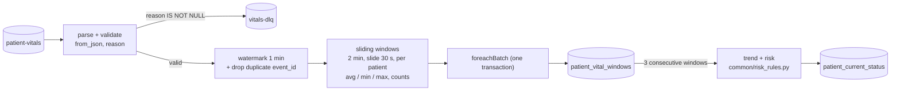

# Report sections drafted by Member A (Ninada)

Sections §2, §3, §6 and §7a of the EC8203 mini-project report. Reviewers: Imalsha (B) and Kasun (C);
§3 is reviewed by both. Figures marked **[Screenshot]** are in `docs/screenshots/`.

---

## 2. Business requirements

**Use case 2: Hospital Patient Vital Signs Monitoring.** A ward of 15 patients wears bedside monitors
that report heart rate, SpO₂, blood pressure and temperature every few seconds. Once a day the
pathology lab delivers a file of lab results. The ward asks two questions:

1. *Which patients show concerning vital-sign trends right now?* (seconds matter)
2. *How do yesterday's lab results change the risk picture for those patients?* (once a day)

We read these questions as the requirements below. Each one names the component that meets it and,
where we measured it, the result.

| # | Requirement | Interpretation | Met by | Result |
|---|---|---|---|---|
| R1 | Near-real-time ward view | Every patient's latest vitals, risk and trend visible within seconds of the reading | Q1 → `patient_current_status` → API (§7a) | Reading to table: 6.2 s on average, 9 s at worst |
| R2 | Per-patient threshold alerts | An alert for every reading outside a limit, and a stronger alert when the limit stays broken | Q3 → `patient-alerts` → `vital_alerts` (§8b) | P007 spike: `CRITICAL` alert through the API |
| R3 | Concerning **trends**, not only single values | Heart rate rising or SpO₂ falling across three consecutive windows, beyond sensor noise | Q1 trend (§7a.5) | SpO₂ drop marked `FALLING` 75 s after it started |
| R4 | Daily lab feed | One file per simulated day, loaded completely or not at all | Lab DAG (§7b) | |
| R5 | Daily consolidated risk | Per patient: vital points plus lab points from the newest labs (today or yesterday) → NORMAL / WATCH / CONCERNING | Risk join and report (§7b, §10) | |
| R6 | Queryable serving | An API for the live ward view and a merged speed + batch view per patient | FastAPI (§8b) | |
| R7 | Recompute history | A rule change or bug fix can be applied to past days | Parquet lake + batch jobs (§3, §8a) | Re-running a day gives identical rows |
| R8 | Trustworthy data | Invalid readings never reach the ward view but are kept for diagnosis; no double counting | Validation, dead-letter topic, de-duplication (§7a.2) | |
| R9 | Observable pipeline | Structured logs, metrics and at least one health alert | §9 | |

**Assumptions and simplifications.**
- **Not clinical.** The risk rules (`config/thresholds.yaml`) are project-defined for a
  data-engineering exercise. They are not clinical guidance.
- **Simulated time.** One simulated day lasts 300 real seconds (§4.1), so "yesterday's labs"
  are 5 minutes old.
- **One node.** The system runs on one laptop with a single Kafka broker, so replication is 1.
  The design choices are argued for a real ward, and §11 lists what changes at production scale.

---

## 3. Architecture decision: Lambda vs Kappa

**Decision: Lambda.** A speed layer (Spark Structured Streaming) serves question 1 from the vital
stream. A batch layer (Airflow + Spark batch) serves question 2 by recomputing daily views from an
immutable master dataset and the lab file. The serving layer merges the two. Kappa is the rejected
alternative.

### 3.1 The two candidates, concretely

**Lambda (built).** Every reading goes to Kafka. Three streaming queries read it: Q1 (live ward
view), Q3 (alerts) and Q2, which archives every event, valid or not, to a Parquet lake partitioned
by simulated day. Once a day, Airflow waits for the lab file, loads it, recomputes the day's vital
summary from the lake and joins it with the newest labs (Figure 4.1).

**Kappa (rejected).** Kafka's log would be the only source of truth. The lab file would be
published to a `lab-results` topic. One streaming job would compute the live view *and* the daily
view: a day-long event-time window per patient, joined with a stream of lab results. To change a
rule, a new version of the job would replay the topic from the start into new tables, and the
serving layer would switch over when it caught up.

### 3.2 Comparison on the four criteria

| Criterion | What the use case needs | Lambda (ours) | Kappa |
|---|---|---|---|
| **Latency** | Live view in seconds; daily view once a day | Speed layer: 6.2 s average from reading to table. Daily view ready about 1–2 min after the day ends | Same live latency. The daily view is also streaming, so it can update during the day, but "yesterday" is only final once the day's window closes |
| **Replay** | Recompute any past day after a rule change or bug fix | The lake keeps every raw event (and the raw payload) indefinitely. Recomputing day N reads one partition (`sim_day=N`); our summary job takes about 43 s per day and gives identical rows on a re-run | Replay is bounded by Kafka retention (7 days here). History beyond it is lost unless retention is unlimited, which makes the broker the long-term store. The lab file is not in Kafka at all unless we add a topic for it |
| **Consistency** | The daily risk must be complete and repeatable; the live view may be approximate | The batch view counts every event, including readings that arrived too late for the speed layer's 1-minute watermark. Days are replaced atomically, so a re-run gives the same answer | One job, one code path, so no drift between layers. But the daily answer is only as complete as the stream's watermark allows: a late reading is dropped for good unless the watermark is widened, which holds state longer |
| **Cost** | Small team, two weeks, one laptop | Two processing paths to build and run. We limit the logic cost with one shared rules module (§7b.4), and the batch path is cheap: it runs once per simulated day | One codebase and one runtime. But the daily join needs a day of state per patient in the streaming job, and every reprocessing replays and recomputes the whole topic |

### 3.3 Why Lambda fits this use case

1. **Half the data is a daily file.** The lab feed has batch semantics. It is complete only when
   the whole file has arrived (the `_SUCCESS` marker), it can be late or missing, and a bad file
   must be rejected as a whole. Airflow's FileSensor, validation, retries and failure callbacks
   (§7b.2) model this directly. In Kappa, the file would have to be turned into a stream, and a
   streaming job would then have to rebuild the idea of "the file for day N is complete". That is
   the batch layer again, rebuilt inside a streaming job.
2. **The question has two time scales.** Question 1 needs an answer in seconds and can accept an
   approximation. Question 2 is asked once a day and must be complete and repeatable, because it
   is a report that people act on. Lambda gives each question its own path with the right trade-off.
3. **Replay beyond Kafka retention.** Rules in a monitoring system change, and when they do the
   ward wants past days recomputed. The Parquet lake keeps the raw events and costs nothing to keep.
   Partitioning by `sim_day` means one day is recomputed by reading one folder. Kafka can seek by
   timestamp too, but only within its retention period.
4. **The brief asks for orchestrated historical reporting.** A scheduled daily job with a DAG,
   retries and a report file is the batch layer. Kappa would need a separate scheduler for the
   report anyway.

### 3.4 Rejected alternative: when Kappa would win

Kappa would be the better choice if the labs arrived as individual result events (for example HL7
messages as each test finishes) rather than as a daily file, if long Kafka retention (or tiered
storage) were available, and if the team could afford only one runtime. In that world the second
code path would buy little. It is not our world: the brief fixes the lab source as a daily file.

### 3.5 Trade-offs we accept, and how we contain them

| Lambda weakness | How it shows up here | Mitigation |
|---|---|---|
| The same logic is written twice and drifts apart | "Abnormal" and "risk" are needed in Q1, Q3, the daily summary, the risk join and the API | One rules module built from one `thresholds.yaml`, as Python and as Spark expressions, with parity tests (§7b.4). The daily summary reuses Q1's `is_abnormal()` |
| Two answers to one question | Live vital risk comes from a 2-minute window; daily vital risk from the whole day, so a patient can be NORMAL now and WATCH for the day | Both are shown, labelled by source: the API's merged view returns `speed_view` and `batch_view` separately (§8b) |
| Batch results are not live | Day N's risk appears 1–2 minutes after the day ends | Acceptable for a daily report; the live question is answered by the speed layer |
| More moving parts | Kafka, Spark streaming, Spark batch, Airflow, Postgres | One Compose file with pinned versions; health alerts on each layer (§9) |
| Both layers compete for one machine | On a 4 GB laptop a daily run occasionally took longer than a simulated day (§10.4) | Each Spark app is capped at 2 cores; the DAG skips ahead rather than queueing (§7b.1) |

---

## 6. Data design

### 6.1 Vital-sign event

One JSON object per reading, produced by `simulators/vital_producer/main.py`:

| Field | Type | Example | Notes |
|---|---|---|---|
| `event_id` | UUID string | `67406ac3-…` | Unique per reading and per run; used for de-duplication and alert ids |
| `patient_id` | string | `P007` | Kafka message key |
| `bed_id` | string | `BED-07` | Fixed per patient |
| `heart_rate` | int, bpm | `82` | Valid range 20–250 |
| `spo2` | float, % | `96.8` | Valid range 50–100 |
| `systolic_bp`, `diastolic_bp` | int, mmHg | `121`, `79` | Valid 50–260 and 20–160 |
| `temperature` | float, °C | `36.9` | Valid 30–45 |
| `timestamp` | ISO 8601, UTC, ms | `2026-09-28T08:00:03.412+00:00` | **Event time**: all windows and `sim_day` use it |

The *valid ranges* are physical plausibility limits: a value outside them is a sensor or
transmission error and is rejected to the dead-letter topic. They are separate from the *clinical
thresholds* in `thresholds.yaml`, which only mark a valid reading as abnormal.

**Simulator.**
- **Patients.** 15 patients (P001–P015), each with a random resting baseline and Gaussian noise.
  Each patient reports on its own 2–5 s rhythm, scheduled by one min-heap.
- **Spikes.** 3 % of readings are single abnormal spikes on one vital.
- **Seeding.** The values come from a seeded generator (`--seed`); only the timestamps and
  `event_id`s change between runs.
- **Demo scenarios (A8).** `spike`, `hr_spike`, `spo2_drop` and `outage` are also seeded. The same
  seed gives the same alerts: two live runs raised the same 48 threshold alerts, at the same offsets
  to within 4 ms.
- **Malformed events.** `--malformed-rate` injects bad events (missing field, null, wrong type,
  out of range, invalid JSON) to exercise the dead-letter path.

### 6.2 Kafka topics and producer

| Topic | Partitions | Key | Content | Written by → read by |
|---|---|---|---|---|
| `patient-vitals` | 3 | `patient_id` | Raw readings | Producer → Q1, Q2, Q3 |
| `vitals-dlq` | 1 | `patient_id` | Rejected readings with `reason`, raw payload, source partition and offset | Q1 → operators |
| `patient-alerts` | 3 | `patient_id` | Alerts | Q3 → alert consumer |

- **Retention.** 7 days (`KAFKA_LOG_RETENTION_HOURS=168`), so any recent period can be replayed
  from Kafka as well as from the lake.
- **Replication.** The replication factor is 1, because there is a single broker.

**Why the key is `patient_id`.** Kafka keeps order only within a partition. Keying by patient puts
all of a patient's readings on one partition, in order. Q1's windows, the trend and Q3's sustained
alerts are all per patient, so per-patient order is the order that matters.

**Producer settings.**
- **`acks=all`.** The leader acknowledges a write only once it is replicated.
- **`enable.idempotence=true` with 10 retries.** A retried batch is written once, not twice.
- **`linger.ms=20`.** Small batches, at a tiny latency cost.
- **`murmur2` partitioner.** The same hash as the Java client, so any client would place a patient
  on the same partition.
- **Delivery callback.** Each message's callback counts it as sent or failed in Prometheus metrics
  (§9) and warns if a patient ever changes partition.

**Observed partition layout** [Screenshot: `a_kafka_partitions.png`]:

| Partition | Patients | Messages (at capture) |
|---|---|---|
| 0 | P003, P005, P008, P009, P010, P012, P013, P014 | 66,581 |
| 1 | P002, P006, P007, P011, P015 | 41,620 |
| 2 | P001, P004 | 16,633 |

Each patient stayed on one partition for the whole run, as intended.

**Skew.** The load is uneven, 8/5/2 patients per partition: hashing 15 keys into 3 buckets is
lumpy. At this volume it does not matter; the lag stayed at 0. On a real ward with hundreds of
patients the hash evens out. For a small, fixed set of keys, a custom partitioner or more
partitions than consumers would reduce the skew.

### 6.3 Simulated clock in the data

`sim_day` is derived from **event time**, never from arrival time, through
`common/sim_clock.sim_day_column()`, the same function in Q1, Q2 and Q3 (§4.1). A reading produced
at 23:59:59 of a simulated day therefore belongs to that day even if Spark processes it after
midnight. The lake partition, the daily summary and the risk join all agree on which day it is.

Readings older than `SIM_EPOCH` get negative day numbers. This happened once, after Q2's first start
from the earliest Kafka offset picked up test data from the day before the epoch. Those days are
never requested by the DAG, so they are harmless, but a production system would reject events
before its epoch.

### 6.4 Tables written by the vitals slice

| Table | Grain | Key columns | Main columns |
|---|---|---|---|
| `patient_current_status` | 1 row per patient (the live view) | `patient_id` | Current 2-min window; avg/min/max of each vital; `reading_count`, `abnormal_count`; `hr_trend`, `spo2_trend`; `vital_risk_score`, `vital_risk_category`; `sim_day`; `updated_at` |
| `patient_vital_windows` | 1 row per patient per window, last 10 min | `patient_id, window_start` | `avg_heart_rate`, `avg_spo2`, `reading_count`: the history the trend needs (§7a.5) |
| `vital_daily_summary` | 1 row per patient per simulated day | `sim_day, patient_id` | Daily avg/min/max of each vital, `reading_count`, `abnormal_count`, `computed_at` |

**Dead-letter record** (`vitals-dlq`):

```json
{"reason": "missing_or_null:heart_rate", "raw": "<original Kafka value>",
 "source_partition": 1, "source_offset": 40211, "detected_at": "..."}
```

`reason` names the first failed check (`malformed_json`, `wrong_type`, `missing_or_null:<fields>`,
`bad_timestamp`, `out_of_range:<fields>`), and the partition and offset point back to the original
message. In the run above, the 17 dead-lettered events were 6 missing or null, 5 wrong type,
3 malformed JSON and 3 out of range.

---

## 7a. Streaming processing

The speed layer is one Spark application (`spark/streaming/app.py`) running five streaming queries
on the `patient-vitals` topic. Each query has its own checkpoint, so each one restarts from exactly
where it stopped.

| Query | Owner | Trigger | Output |
|---|---|---|---|
| `q1_windows` | A | 10 s | `patient_current_status`, `patient_vital_windows` |
| `q1_dlq` | A | 10 s | Kafka `vitals-dlq` |
| `q2_archive` | B | 30 s | Parquet lake (§8a) |
| `q3_threshold_alerts`, `q3_sustained_alerts` | C | 10 s | Kafka `patient-alerts` (§8b) |

**Figure 7a.1: Q1, from Kafka to the live ward view.**



### 7a.1 Parse and validate

- **Parsing.** `from_json` parses each message against an explicit schema, with a
  corrupt-record column that catches broken JSON and wrong types.
- **Rejection reason.** A single `reason` expression checks, in order: malformed JSON, wrong type,
  missing or null fields, unparseable timestamp, and values outside the plausible ranges (§6.1).
  The first failed check becomes the reason, so every rejected event has exactly one.
- **Dead-letter topic.** A second query writes rejected events, with their raw payload, to
  `vitals-dlq` [Screenshot: DLQ messages in Kafka UI]. Nothing is dropped silently. Q2 archives
  rejected events too, so they can be reprocessed if the rules change.

### 7a.2 Event time, watermark and de-duplication

- **Event time.** Windows are computed on `timestamp`, not on arrival time. A reading delayed in
  the network still lands in the window it belongs to.
- **Watermark.** The watermark is 1 minute behind the newest event seen. Readings older than that
  are dropped, and window and de-duplication state older than that is discarded, so memory stays
  bounded. In the Spark UI, state stays flat at about 600 rows and the watermark gap at about 70 s
  [Screenshot: `a_q1_statistics.png`].
- **De-duplication.** `dropDuplicatesWithinWatermark(["event_id"])` removes re-delivered readings;
  a producer retry or a replayed batch cannot count twice.
- **Tested.** A streaming unit test runs Q1's real code over two micro-batches. A duplicate is
  counted once, a reading 3 minutes late changes no window, and a duplicate arriving in a later
  batch changes nothing (`tests/slice_a/test_q1_windows.py`).

### 7a.3 Sliding windows

Per patient, a **2-minute window sliding every 30 s** computes, for each vital:
- the average, minimum and maximum;
- `reading_count`, and `abnormal_count` (readings beyond the thresholds).

Two minutes hold 25–60 readings, enough to smooth noise while still reacting within a minute. The
30-second slide means each reading sits in four overlapping windows.

The query runs in **update** output mode: each micro-batch emits only the windows that changed.

The live view shows, for each patient, the window that ends with the patient's latest reading:
among the four windows holding that reading, the earliest-starting one. That window covers the
fullest two minutes of history.

### 7a.4 Sink: `foreachBatch` in one transaction

Each micro-batch runs, in **one PostgreSQL transaction**:
1. Upsert every changed window into `patient_vital_windows`.
2. Read back the recent windows of the batch's patients, and compute trend and risk (§7a.5–7a.6).
3. Upsert one row per patient into `patient_current_status`. The upsert has a guard,
   `WHERE last_event_time <= EXCLUDED.last_event_time`, so a late batch never replaces a newer
   window with an older one.
4. Delete windows older than 10 minutes.

**Effectively exactly-once.** The checkpoint records the Kafka offsets of every batch. After a
crash, Spark re-runs the unfinished batch. Every statement above is an upsert or a deletion by age,
so re-running a batch leaves the tables exactly as one run would. Kafka offsets in the checkpoint,
plus an idempotent sink, give exactly-once *results* even though the sink itself is at-least-once.

### 7a.5 Trend across micro-batches

A micro-batch only emits the windows it touched, so it cannot see three consecutive windows by
itself. Q1 therefore keeps the last 10 minutes of windows in `patient_vital_windows` and reads them
back.

**Rule** (`trend_label`). Take the three windows ending at the current one, exactly 30 s apart.
- **RISING:** each window's average is higher than the one before, and the total rise is at least
  the minimum change.
- **FALLING:** the mirror image.
- **STABLE:** anything else.
- **No trend (NULL):** fewer than three consecutive windows, for example after the producer
  stopped.

The minimum change (heart rate 5 bpm, SpO₂ 1 point; in `thresholds.yaml`) matters. Overlapping
windows share 75 % of their readings, so random noise alone often produces three small rises in a
row. Without a minimum, the trend would flicker.

**Result.** In the `spo2_drop` scenario, P007's SpO₂ was marked `FALLING` 75 s after the decline
began, and heart rate `RISING` 30 s later.

### 7a.6 Vital risk

Each current window is scored with the shared rules (`common/risk_rules.py`):
- SpO₂ below 92: 2 points.
- Heart rate outside 50–120: 1 point.
- Temperature above 38.0: 1 point.
- Systolic pressure outside 90–160: 1 point.
- A rising heart rate or falling SpO₂ trend: 1 point.

The total maps to NORMAL (0–1), WATCH (2–3) or CONCERNING (4 or more). These are the same rules
the batch risk join and the API use (§7b.4).

**Result.** In the Checkpoint 1 run, P007's `spike` scenario took P007 to the top of
`/api/patients?sort=risk` as CONCERNING, 4 points (low SpO₂, high heart rate, trend), with
CRITICAL sustained alerts from Q3.

### 7a.7 Measured behaviour

From the application's own progress logs over 30 minutes (180 micro-batches per query) on the
development laptop:

| Query | Median batch | 95th percentile | Max Kafka lag | Rows dropped by watermark |
|---|---|---|---|---|
| `q1_windows` | 4.0 s | 4.9 s | 0 | 0 |
| `q1_dlq` | 0.9 s | 1.6 s | 0 | – |
| `q2_archive` | 2.1 s | 2.5 s | 0 | – |
| `q3_threshold_alerts` | 1.4 s | 1.8 s | 0 | – |
| `q3_sustained_alerts` | 3.8 s | 4.7 s | 0 | 0 |

**Freshness.** In `patient_current_status`, `updated_at` was on average 6.2 s after the reading's
event time, and at most 9 s. Every batch finished well inside its 10 s trigger, and the lag stayed
at zero: the speed layer keeps up with the ward with room to spare.
[Screenshot: `a_spark_streaming.png`, five active queries]

### 7a.8 Limits of this design

These points feed into §11.
- **Driver-side sink.** The sink collects at most 15 rows per batch to the driver and writes them
  with psycopg2. That is right for one ward, but for thousands of patients it would become a
  JDBC bulk write into a staging table plus a `MERGE`.
- **Trend history in Postgres.** Keeping the trend history in Postgres couples the streaming job to
  the database. Spark's arbitrary stateful processing (`applyInPandasWithState`) could keep the
  last three windows in the checkpointed state instead, at the cost of more complex code.
- **Watermark trade-off.** A reading more than 1 minute late never reaches the live view. It still
  reaches the lake and the daily summary, which is exactly the consistency trade-off argued in §3.
