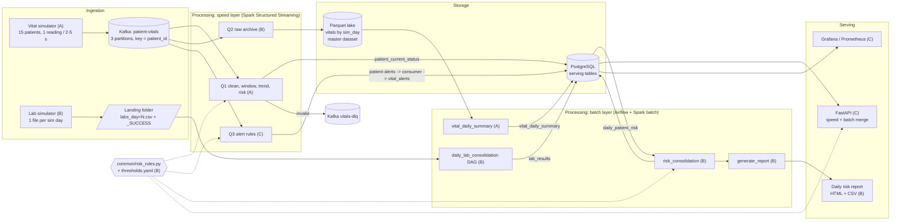
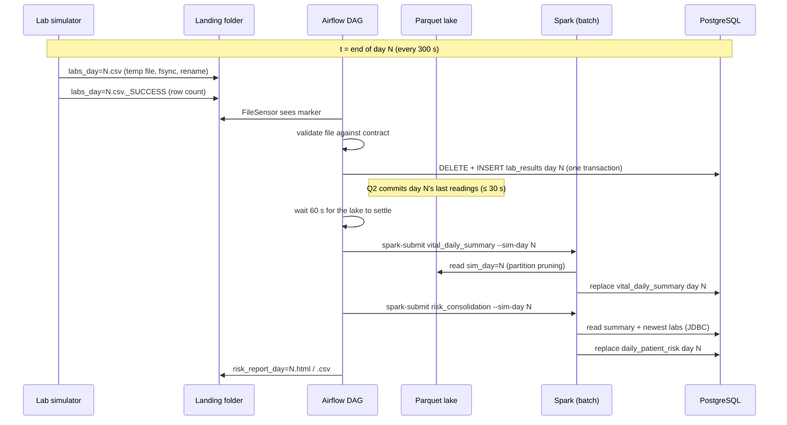
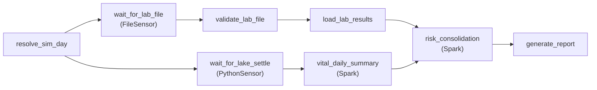

# Report sections drafted by Member B (Imalsha)

Sections §4, §7b, §8a and §10 of the EC8203 mini-project report. Reviewer: Kasun (C).
Figures marked **[Screenshot]** are taken on the demo laptop and saved to `docs/screenshots/`.

---

## 4. Architecture

The pipeline follows the Lambda architecture chosen in §3: a **speed layer** turns the vital-sign
stream into live patient status and alerts within seconds, a **batch layer** recomputes a daily
risk view from an immutable master dataset and the daily lab file, and a **serving layer** merges
both views. Figure 4.1 shows every component, grouped by layer, with the member who built it.

**Figure 4.1: Component architecture (ingestion, processing, storage, serving).**

Three design choices shape the diagram:

1. **One master dataset.** Q2 archives every Kafka event, including invalid ones, to a Parquet lake
   partitioned by simulated day. The batch layer reads only the lake, never Kafka, so any day can be
   recomputed after a rule change or a bug fix. This is the "replay" property that motivated Lambda (§3).
2. **One set of rules for both layers.** The dashed lines in Figure 4.1 show the single rules module
   imported by Q1, Q3, the risk join and the API. It is the project's answer to Lambda's main weakness,
   duplicated logic that drifts apart (§7b.4).
3. **Files are handed over through a contract, not by timing.** The lab simulator writes each file
   atomically and then a `_SUCCESS` marker; Airflow waits for the marker. Producer and consumer share
   the same contract module (`common/lab_feed.py`).

### 4.1 Simulated clock

One simulated day lasts **300 real seconds**. Every component computes
`sim_day = floor((t − SIM_EPOCH) / 300)` through the shared `common/sim_clock.py`, with `SIM_EPOCH`
and the day length read from one configuration (`config/app.yaml`, overridden by `.env`). A reading's
`sim_day` comes from its event time; a lab file's day is fixed when the simulator writes it.

### 4.2 One simulated day, end to end

**Figure 4.2: What happens when simulated day N ends.**

### 4.3 Deployment

All services run under one Docker Compose file with pinned versions: Kafka 3.9 (KRaft), Spark 3.5.5
standalone (one master, one 4-core worker), Airflow 2.10.5 (LocalExecutor), PostgreSQL 16, FastAPI,
and a `monitoring` profile with Prometheus, Pushgateway, kafka-exporter and Grafana. The streaming
application and each batch job are capped at 2 Spark cores, so a daily job can run next to the
long-running streaming queries on a single worker. Airflow submits Spark jobs in client mode (the
driver runs in the Airflow container, the executors on the Spark worker).

---

## 7b. Batch processing

The batch layer answers the second half of the business question: *how do the latest lab results
change each patient's risk?* It is one Airflow DAG, `daily_lab_consolidation`, that runs once per
simulated day and carries a lab file all the way to the daily report (Figure 7b.1).

**Figure 7b.1: The DAG. [Screenshot: Airflow graph view of a successful run]**

### 7b.1 Which day a run processes

The DAG is scheduled every 300 s from `SIM_EPOCH`, so each run's data interval matches one
simulated day. A scheduled run processes the day that has just ended; a manual run accepts
`{"sim_day": N}` to process or re-run any day. With `catchup=False` and `max_active_runs=1`, a run
that takes longer than one simulated day makes Airflow skip ahead to the latest day instead of
building an ever-growing queue; a skipped day can be re-run by hand.

### 7b.2 Lab branch: sense, validate, load

- **Sensing.** A FileSensor waits for `labs_day=N.csv._SUCCESS`, not for the CSV. The simulator
  writes the CSV to a hidden temporary file, flushes it to disk, renames it (an atomic operation) and
  only then writes the marker, so the DAG can never read a half-written file. The sensor runs in
  `reschedule` mode, freeing its worker slot between checks, and fails after two simulated days: the
  "lab file missing" case.
- **Validation.** Every row is checked against the shared contract: exact header; numeric,
  finite, non-negative results; a known test type; a well-formed patient id; a non-empty unit;
  `reference_low ≤ reference_high`; a timezone-aware `collected_at` inside day N; no duplicate
  (patient, test, time). The number of data lines must equal the count in the marker, which catches
  a truncated copy. One bad row fails the whole file, and the task fails **without retries**:
  retrying cannot repair bad data.
- **Loading.** `DELETE` of day N followed by `INSERT` of the file's rows, **inside one transaction**.
  A re-run leaves exactly one copy of the day; a failure half-way rolls back to the previous state.
  Transient database errors are retried twice.

### 7b.3 Vitals branch: daily summary from the lake

`vital_daily_summary` (Member A) is a Spark batch job over the Parquet lake. It reads only
partition `sim_day=N` of valid events, removes repeated `event_id`s, and writes per-patient daily
averages, minima, maxima, reading counts and abnormal counts. Because Q2 commits to the lake every
30 s, the last readings of day N arrive shortly after the day boundary; a PythonSensor therefore
waits until 60 s after day N ends before the summary starts.

### 7b.4 Risk consolidation: the join

`risk_consolidation` is a Spark job that reads `vital_daily_summary` and `lab_results` from
PostgreSQL over JDBC and produces one row per patient in `daily_patient_risk`:

1. **Newest labs per patient.** A window function takes, for each patient, the newest lab day
   within `[N − 1, N]`. A patient missing from today's file therefore falls back to yesterday's
   results, and `lab_sim_day` records which day was used. Older results are treated as stale.
2. **Scores.** Lab points (+1 out of range, +2 beyond 1.5× the limit) are summed per patient and the
   abnormal tests listed (e.g. `crp:HIGH,lactate:HIGH`). Vital points and their reasons are computed
   from the daily summary.
3. **Left join over the whole ward.** Every patient gets a row. A patient without recent labs is
   `LAB_UNAVAILABLE` with a NULL lab score, never 0, and the total then counts vitals only. An
   inner join would have silently dropped these patients.
4. **Category.** total = vital points + lab points: 0–1 NORMAL, 2–3 WATCH, ≥ 4 CONCERNING.

All scoring goes through `common/risk_rules.py`, which builds every rule twice from the same
`thresholds.yaml`: as plain Python (used by the API and the report) and as Spark column expressions
(used by Q1, Q3 and this job). Parity tests run several hundred input combinations through both forms
and require identical points and reasons. The speed and batch layers therefore cannot disagree about
what "concerning" means, which removes the main maintenance risk of Lambda.

### 7b.5 Report

`generate_report` renders `daily_patient_risk` for day N as a self-contained HTML page and a CSV
file (§10). Next to each patient's combined category it shows the category from vitals alone, so
the reader sees directly where lab results changed the picture, plus the change since yesterday
and the day's speed-layer alert count. Files are written atomically; a re-run replaces them.

### 7b.6 Failure handling and observability

Every task failure writes a `FAIL` row to `pipeline_health` through an `on_failure_callback`; the
API exposes these rows and Prometheus alerts on them. All tasks and jobs log one JSON object per event
through the shared logger. The lab tasks push rows loaded, schema errors, file arrival time and load
duration to the Pushgateway, and the lab simulator serves `/metrics` for scraping. Two alert rules
belong to this layer: **LabFileInvalid** (the last file failed validation) and **LabFeedStopped**
(no new lab file for two simulated days), alongside the team's **LabFileLate** rule on `lab_results`.

---

## 8a. Storage

The system uses two stores with different jobs: a **Parquet lake** as the immutable master dataset,
and **PostgreSQL** as the queryable serving store.

### 8a.1 Parquet lake (master dataset)

| Property | Design |
|---|---|
| Location | `/data/lake/vitals/`, a Docker volume shared by Spark and Airflow |
| Layout | Hive-style partitions `sim_day=N/part-*.parquet` |
| Content | Every Kafka event: parsed fields, Q1's validity `reason` (NULL = valid), the original raw payload, Kafka partition and offset, ingest time |
| Writer | Q2, a Spark file sink with a 30 s trigger and its own checkpoint |
| Readers | `vital_daily_summary`, and any recomputation, through `read_lake()` |

Partitioning by simulated day matches the batch access pattern: a daily job filters `sim_day = N`,
which Spark turns into **partition pruning**, so only that day's folder is scanned. Keeping invalid
events and the raw payload means a day can be reprocessed if the validation rules change; nothing
is ever updated in place. Parquet was chosen over row formats because the batch jobs read a few
columns across many rows, and its columnar compression keeps a day of readings small.

**Exactly-once.** The checkpoint stores the Kafka offsets of each micro-batch, and the file sink
lists the files of every committed batch in `_spark_metadata`. After a crash Spark re-runs the
unfinished batch; files from the failed attempt are not in the log. Readers must therefore read the
lake root, which follows the log, rather than a partition folder directly; `read_lake()` does this.

### 8a.2 PostgreSQL (serving store)

| Table | Written by | Key | Re-run behaviour |
|---|---|---|---|
| `patient_current_status` | Q1 (speed) | `patient_id` | Upsert: newest window wins |
| `patient_vital_windows` | Q1 (speed) | `patient_id, window_start` | Upsert |
| `vital_alerts` | Alert consumer (speed) | `alert_id` (deterministic) | Duplicate key skipped |
| `lab_results` | Lab DAG (batch) | `sim_day, patient_id, test_type, collected_at` | Day replaced in one transaction |
| `vital_daily_summary` | Spark batch (A4) | `sim_day, patient_id` | Day replaced in one transaction |
| `daily_patient_risk` | Spark batch (B8) | `sim_day, patient_id` | Day replaced in one transaction |
| `pipeline_health` | DAG callbacks, checks | `id` | Append-only log |

Every writer is **idempotent**: an Airflow retry, a Spark restart or a manual re-run leaves the same
table contents as a single run. The speed-layer tables use upserts or deterministic keys; the batch
tables replace a whole day with `DELETE` + `INSERT` in one transaction, so readers see either the old
day or the new day, never a mixture.

Integrity rules live in the schema, not only in code: `lab_results` rejects NULL values and
`reference_low > reference_high`, and `daily_patient_risk` enforces
`(lab_status = 'LAB_UNAVAILABLE') = (lab_risk_score IS NULL)`, so "no labs" can never be stored as
a lab score of 0. Lineage columns (`source_file`, `loaded_at`, `lab_sim_day`, `generated_at`) record
where each row came from.

### 8a.3 Landing zone

Lab files arrive in `data/landing/labs/`, a folder shared by the simulator and Airflow. Each file is
immutable once its marker exists, and the simulator refuses to overwrite a completed day unless
forced. Rewriting a day produces a byte-identical file, because each day's content is generated from
a seed derived from the day number.

---

## 10. Results

All results below come from the running pipeline on one laptop (Docker Desktop, 4 GB assigned),
simulated clock 1 day = 300 s, 15 patients.

### 10.1 Consolidated daily risk report

The DAG produced the report for simulated day 85 without manual steps: the lab file was loaded
14 s after it appeared, and the Spark summary, risk join and report followed. Table 10.1 is an
excerpt; the complete files are in `reports/sample/`.

**Table 10.1: Daily risk report, sim day 85 (excerpt).**

| Patient | Category | Total | Vital pts (reasons) | Lab pts (abnormal labs) | Vitals alone | Labs changed |
|---|---|---|---|---|---|---|
| P007 | CONCERNING | 12 | 4 (spo2_low, temperature_high, systolic_bp_high) | 8 (creatinine, crp, lactate high; haemoglobin low) | CONCERNING | – |
| P003 | CONCERNING | 4 | 3 (spo2_low, systolic_bp_high) | 1 (lactate high) | WATCH | **WATCH → CONCERNING** |
| P006 | CONCERNING | 4 | 2 (temperature_high, systolic_bp_high) | 2 (lactate high) | WATCH | **WATCH → CONCERNING** |
| P011 | CONCERNING | 4 | 3 (spo2_low, temperature_high) | 1 (crp high) | WATCH | **WATCH → CONCERNING** |
| P012 | WATCH | 3 | 3 (spo2_low, systolic_bp_high) | 0 | WATCH | – |
| P001 | NORMAL | 1 | 0 | 1 (creatinine high) | NORMAL | – |
| P004 | NORMAL | 0 | 0 | 0 (labs from day 84) | NORMAL | – |

Day 85 summary: **5 concerning, 3 watch, 7 normal**; for **3 patients** (P003, P006, P011) the lab
results moved the category from WATCH to CONCERNING, which is the answer to the business question's
second half. P004 had no labs in day 85's file and was scored with day 84's results. P007, the demo
patient whose simulated labs always show high CRP and lactate, is the highest-risk patient of the day.

**[Screenshot 10.1: `risk_report_day=85.html` in a browser]**

### 10.2 Correctness evidence

| Claim | Evidence |
|---|---|
| The lake stores every Kafka event exactly once | 21,517 rows = 21,517 distinct (partition, offset) pairs after several streaming restarts |
| Re-running a day does not duplicate data | Day 71 loaded at 06:00:12 and re-run at 06:01:36: 84 rows both times; `daily_patient_risk` day 77 computed twice: 15 rows |
| The lab file is complete when loaded | Day 68: 80 rows loaded = 80 rows stated in the `_SUCCESS` marker |
| A bad file is rejected, not loaded | A file with timestamps outside its day failed validation once (no retries), 0 rows loaded, `pipeline_health` FAIL: "84 problems: … outside sim day" |
| Missing labs are not scored as 0 | Unit tests and a database check constraint; `LAB_UNAVAILABLE` rows carry a NULL lab score |
| Speed and batch layers use identical rules | Spark vs Python parity tests over several hundred combinations: identical points and reasons |
| The pipeline recovers from crashes | Kafka and the streaming app were killed by the OS under memory pressure; both restarted automatically and resumed from checkpoints with no lost or duplicated lake rows |

**[Screenshot 10.2: Airflow grid view with successful daily runs]**
**[Screenshot 10.3: lake folders `sim_day=N` and `_spark_metadata`]**

### 10.3 Tests

Member B's slice has 110+ automated tests (pytest), run in the project's Docker images: lab
simulator content and atomic writes, twelve kinds of invalid lab file, transactional loading and
rollback, every risk-rule boundary, Spark/Python rule parity, the lake archive with repeated
restarts, the risk join on a hand-built ward (fallback to yesterday's labs, stale labs, missing
vitals), report content and HTML escaping, and a DagBag import test of the DAG.

### 10.4 Observations

- **Daily minima and maxima are strict.** The daily summary scores the extreme reading of the day,
  so a single transient spike (3 % of readings by design) can add points for the whole day; many
  patients show `spo2_low` on a given day. Averages or a "sustained for k readings" rule would suit a
  daily view better (§11).
- **Timing on constrained hardware.** On the 4 GB development laptop the lab branch took 14 s,
  the daily summary 1.4 min and the risk join up to 7.7 min under memory pressure, so the whole run
  occasionally exceeded one simulated day and Airflow skipped a day as designed. The demo machine
  has more memory; its timings replace these in the final version. **[TODO: measure on demo laptop]**
